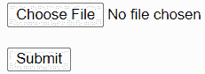
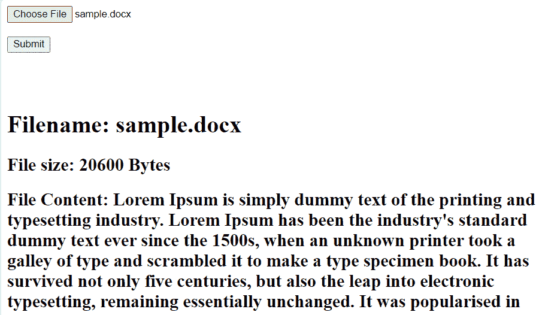

# 如何在 AngularJS 中获取文件内容等细节？

> 原文:[https://www . geesforgeks . org/如何获取文件内容和其他详细信息 in-angularjs/](https://www.geeksforgeeks.org/how-to-get-file-content-and-other-details-in-angularjs/)

我们可以通过使用一些基本的角度函数和其他细节来获取文件内容，比如 AngularJS 中文件的名称和大小。为了理解它，请看下面的例子，其中实现了 HTML 和 JS 文件。

**注意:**考虑下面两个文件在角度上分量相同。

**app.module.html:**

```ts
<!-- Script for display 
data in particular format -->

<!DOCTYPE html> 
<html>
<script src=
"https://ajax.googleapis.com/ajax/libs/angularjs/1.6.9/angular.min.js">
  </script> 
<body ng-app="myApp">
    <div ng-controller="MyCtrl">
        <input type="file" id="myFileInput" />
        <button ng-click="submit()"> Submit</button>
        <br /><br />
        <h1>
            Filename: {{ fileName }}
        </h1>
        <h2>
            File size: {{ fileSize }} Bytes
        </h2>
        <h2>
            File Content: {{ fileContent }}
        </h2>
    </div>
</body>
</html>
```

**输出:**


在上面的 HTML 文件中，我们简单地对网页的外观做了一个结构。为此，我们使用了一些有角度的东西，比如“ng-controller”和双花括号，我们将在下面的 javascript 代码中实现它们。

**app.module.ts:**

```ts
import { BrowserModule } from 
        '@angular/platform-browser'; 
import { NgModule } from '@angular/core'; 
import { AppComponent } from './app.component'; 
import { BrowserAnimationsModule } from 
        '@angular/platform-browser/animations'; 
import { FormsModule, ReactiveFormsModule } 
        from '@angular/forms'; 
import { MatInputModule } from 
        '@angular/material/input'; 
import { MatDialogModule } from 
        '@angular/material/dialog'; 
import { MatFormFieldModule } from 
        '@angular/material/form-field'; 
import { MatIconModule } from 
        '@angular/material/icon'; 

@NgModule({ 
    declarations: [ 
        AppComponent, 
    ], 
    imports: [ 
        BrowserModule, 
        FormsModule, 
        BrowserAnimationsModule, 
        MatInputModule, 
        MatFormFieldModule, 
        MatIconModule, 
        MatDialogModule, 
    ], 
    bootstrap: [AppComponent] 
}) 
export class AppModule { } 
```

**app.component.ts:**

```ts
// Code to get file content
// and other data
import { Component, OnInit }  
        from '@angular/core'; 

// Imports 
import { FormGroup, FormControl,
          } from '@angular/forms';

@Component({ 
    selector: 'app-root', 
    templateUrl: './app.component.html', 
    styleUrls: ['./app.component.scss'] 
}) 
export class AppComponent implements OnInit { 

    constructor() { } 

    ngOnInit() { 
    }

    var myApp = angular.module('myApp', []);

    myApp.controller('MyCtrl', function ($scope) {

        // Intially declaring empty string 
        // and assigning size to zero 

        $scope.fileContent = '';
        $scope.fileSize = 0;
        $scope.fileName = '';

        // Implementing submit function 

        $scope.submit = function () {
            var file = document.getElementById("myFileInput")
                                          .files[0];
            if(file) {
                var Reader = new FileReader();
                Reader.readAsText(file, "UTF-8");
                Reader.onload = function (evt) {

                    // Getting required result 
                    // of the file

                    $scope.fileContent = Reader.result;
                    $scope.fileName = document.getElementById(
                                     "myFileInput").files[0].name;
                    $scope.fileSize = document.getElementById(
                                      "myFileInput").files[0].size;;
                }

       // Printing error if data 
       //is not proper 

            Reader.onerror = function (evt) {
                $scope.fileContent = "error";
            }
          }
       }
    }
});
```

**输出:**
