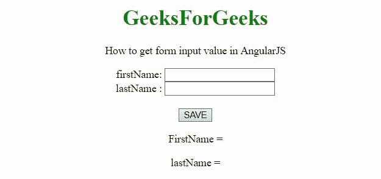
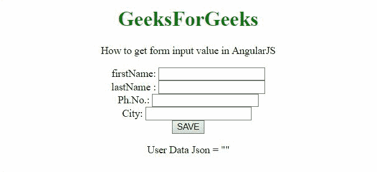

# 如何使用 AngularJS 获取表单输入值？

> 原文:[https://www . geeksforgeeks . org/how-to-form-input-value-use-angularjs/](https://www.geeksforgeeks.org/how-to-get-form-input-value-using-angularjs/)

给定一个表单元素，任务是在 AngularJS 的帮助下获取用户输入的表单值。

**进场:**

*   在用户借助 **Angular.copy(object)方法**将数据输入输入元素后，我们将数据存储在 JSON 对象中。
*   之后，可以很容易地访问来自 JSON 对象的数据。

**示例 1:** 在本例中，数据存储在 JSON 对象中，并从该对象中访问。

## 超文本标记语言

```html
<!DOCTYPE HTML>
<html>

<head>
    <script src=
"https://ajax.googleapis.com/ajax/libs/angularjs/1.2.13/angular.min.js">
    </script>

    <script>
        var myApp = angular.module("app", []);
        myApp.controller("controller", function ($scope) {
            $scope.userData = '';
            $scope.getData = function (user) {
                $scope.userData = angular.copy(user);
            };
        });
    </script>
</head>

<body style="text-align:center;">
    <h1 style="color:green;">
        GeeksForGeeks
    </h1>

    <p>
        How to get form input value in AngularJS
    </p>

    <div ng-app="app">
        <div ng-controller="controller">
            <form action="javascript:void(0)">
                firstName: <input type="text" 
                    ng-model="user.fName" /><br>
                lastName : <input type="text" 
                    ng-model="user.lName" /><br>
                <br>
                <button ng-click="getData(user)">
                    SAVE
                </button>
            </form>

            <p>FirstName = {{userData.fName}}</p>

            <p>lastName = {{userData.lName}}</p>

        </div>
    </div>
</body>

</html>
```

**输出:**



**示例 2:** 在本例中，数据存储在 JSON 对象中，并打印 JSON 对象的数据。

## 超文本标记语言

```html
<!DOCTYPE HTML>
<html>

<head>
    <script src=
"https://ajax.googleapis.com/ajax/libs/angularjs/1.2.13/angular.min.js">
    </script>

    <script>
        var myApp = angular.module("app", []);
        myApp.controller("controller", function ($scope) {
            $scope.userData = '';
            $scope.getData = function (user) {
                $scope.userData = angular.copy(user);
            };
        });
    </script>
</head>

<body style="text-align:center;">
    <h1 style="color:green;">
        GeeksForGeeks
    </h1>

    <p>
        How to get form input 
        value in AngularJS
    </p>

    <div ng-app="app">
        <div ng-controller="controller">
            <form action="javascript:void(0)">
                firstName: <input type="text" 
                    ng-model="user.fName" />
                <br>
                lastName : <input type="text" 
                    ng-model="user.lName" />
                <br>
                Ph.No.: <input type="text" 
                    ng-model="user.Phone" />
                <br>
                City: <input type="text" 
                    ng-model="user.city" />
                <br>
                <button ng-click="getData(user)">
                    SAVE
                </button>
            </form>

            <p>User Data Json = {{userData | json}}</p>

        </div>
    </div>
</body>

</html>
```

**输出:**

