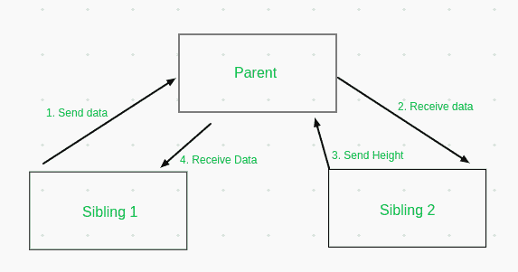

# 如何在 Angular 中获取同级 div 的高度，并将数据发送给同级组件？

> 原文:[https://www . geeksforgeeks . org/如何获取同层部件高度并向同层部件发送数据/角度/](https://www.geeksforgeeks.org/how-to-get-height-of-sibling-div-and-send-data-to-sibling-component-in-angular/)

在这篇文章中，我们将看到如何在一个组件中获取动态 div 的高度，并将其发送到 Angular 中的同级组件。这项任务需要了解一些基本的角度和 DOM 概念。在 angular 中，我们可以使用多种方法向兄弟姐妹发送和接收数据，其中一种方法是通过父节点。见下图。



在 Angular 中，我们可以执行以下步骤:

*   创建一个**事件发射器< T >** 对象，并使用**@输出()**装饰器向父对象发送数据。
*   使用 **@Input()** 装饰器从父级接收数据。
*   使用 **DOM** 的**offset right**属性计算 div 的高度，并将其发送回父级。
*   从父母那里得到身高。

让我们用一个简单的例子来演示这些步骤。我们将创建两个组件: **sibling1** 和 **sibling2** 。在 sibling1 中，我们将从用户那里获取逗号分隔的输入，并使用它来动态填充 sibling2。sibling2 组件将通过父组件动态地将其高度发送回 sibling1。

**先决条件**:必须安装 [NPM](https://www.geeksforgeeks.org/node-js-npm-node-package-manager/) 。

**环境设置:**

*   安装 Angular 并创建一个新项目。

    ```
    npm install -g @angular/cli
    ng new <project-name>
    cd <project-name>
    ```

    **步骤:**

*   创建 2 个名为 sibling1 和 sibling2 的新组件，这将创建两个新目录，每个目录包含 4 个文件。

    ```
    ng g c sibling1
    ng g c sibling2
    ```

在上面的代码中，我们已经使用 **@Input()** 装饰器将**高度**变量设置为该组件的输入。**发射器**对象是一个**事件发射器**对象。在 **send()** 方法中，我们使用目标元素的值并发出数据。

## sibling1.component.ts

```
import { Component, EventEmitter, Input, OnInit, Output } from '@angular/core';

@Component({
  selector: 'app-sibling1',
  templateUrl: './sibling1.component.html',
  styleUrls: ['./sibling1.component.css']
})
export class Sibling1Component implements OnInit {

  constructor() { }

  ngOnInit(): void {
    this.height = 0;
  }

  @Input() height;

  @Output() emitter:EventEmitter<any> = new EventEmitter();
  send(e){
    let data = e.target.value;
    this.emitter.emit(data);
  }
}
```

在**按键**事件上有一个使用 **send()** 方法的输入字段。为了显示**高度**变量，我们使用了一个< p >标签。

## sibling1.component.html

```
<input type="text" (keyup)="send($event)">

<p>Height of Sibling is {{height}}</p>
```