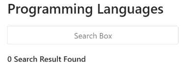

# 如何获取输入值搜索框，并使用回车键在 AngularJS 组件中输入？

> 原文:[https://www . geesforgeks . org/如何获取输入值-搜索框-输入-in-angularjs-component-使用回车键/](https://www.geeksforgeeks.org/how-to-get-input-value-search-box-and-enter-it-in-angularjs-component-using-enter-key/)

在 AngularJS 中实现一个搜索组件，每当用户按下回车键(键码= 13)时，该组件就会调用该函数，然后根据用户输入执行一些相关的任务。这可以使用**按键**事件轻松实现。

这里为了造型的目的，使用了 bootstrap 和 font awesome。

我们需要一个基本的输入标签，它将有一个调用 **onSubmit($event)** 函数的按键事件，并将事件作为参数传递。**$事件**为我们提供了不同类型的属性，但我们将借助**键码**来告诉我们用户按了哪个键。我们使用**键码**检查用户是否按下了**进入**键，其代码为 13。一旦按下**回车**键，您可以执行您想要的任务，例如从列表中搜索或将搜索元素传递给另一个组件。为了简单起见，我们创建了一个小数组，检查数组中的搜索元素并输出结果。

**示例:**

## app.component.html

```tshtml
<div class="container">
  <div class="row">
    <div class="col-md-4"></div>
    <div class="col-md-4">
      <h3>Programming Languages</h3>
      <div class="searchBox">
        <input (keyup)="onSubmit($event)" 
          [(ngModel)]="searchValue" type="text" 
          id="searchKey" class="form-control"
          placeholder="Search Box" />
      </div>

      <div *ngIf="condition; then block1; else block2">
      </div>
      <ng-template #block1>
        <i class="fa fa-spinner fa-spin" aria-hidden="true">
        </i> Searching your results for
        <strong>{{prevText}}</strong>
      </ng-template>
      <ng-template #block2>
        <h6>{{res_cnt}} Search Result Found
          <span *ngFor="let lang of res_list">
            <strong>{{lang}}, </strong></span>
        </h6>
      </ng-template>
    </div>
  </div>
</div>
```

## app.component.css

```tshtml
.searchBox{
   margin: 20px 0;
}

input{
   width: 100%; 
   padding: 10px; 
   text-align: center;
}
```

## app.component.ts

```tshtml
import { Component } from '@angular/core';
import { AbstractControl, FormBuilder, 
    FormGroup } from '@angular/forms';

@Component({
  selector: 'app-root',
  template: './app.component.html',
  styles: ['./app.component.css']
})
export class AppComponent {

  searchValue: string = null;
  condition: boolean = null;
  prevText: string = '';
  list_lang = ['java', 'c++', 'python', 'c', 'javascript'];
  res_list = [];
  res_cnt: number = 0;

  onSubmit($event){
    if($event.keyCode === 13){
      this.condition = true;
      this.prevText = this.searchValue;
      this.res_cnt = 0;
      this.res_list = [];
      setTimeout(() => {
        this.condition = false;
        for(let i=0; i<this.list_lang.length; i++){
          if(this.list_lang[i] === this.prevText.toLowerCase()
             || this.list_lang[i].startsWith(this.prevText)){
            this.res_cnt += 1;
            this.res_list.push(this.list_lang[i]);
          }
        }
      }, 3000);
      this.searchValue = null;
    }
  }
}
```

**输出**

