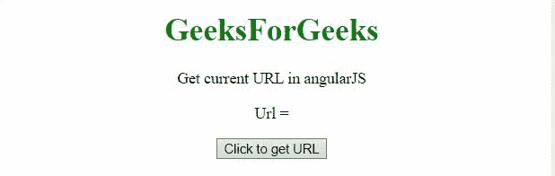

# 如何使用 AngularJS 获取当前网址？

> 原文:[https://www . geeksforgeeks . org/如何使用-angularjs/](https://www.geeksforgeeks.org/how-to-get-the-current-url-using-angularjs/) 获取当前 url

在本文中，我们将看到如何在 AngularJS 的帮助下获得当前的网址。我们将使用**$ location . absolr()方法**获取当前页面的完整 URL。

**语法:**

```tshtml
$location.absURL()
```

**示例 1:** 只需使用**$ location . absolr()方法**即可获取当前页面的完整 URL。

## 超文本标记语言

```tshtml
<!DOCTYPE HTML>
<html>

<head>
    <script src=
"https://ajax.googleapis.com/ajax/libs/angularjs/1.2.13/angular.min.js">
    </script>

    <script>
        var myApp = angular.module("app", []);
        myApp.controller("controller",
            function ($scope, $location) {
                $scope.url = '';
                $scope.getUrl = function () {
                    $scope.url = $location.absUrl();
                };
            });
    </script>
</head>

<body style="text-align:center;">
    <h1 style="color:green;">
        GeeksForGeeks
    </h1>

    <p>
        Get current URL in angularJS
    </p>

    <div ng-app="app">
        <div ng-controller="controller">

            <p>Url = {{url}}</p>

            <input type="button" 
                value="Click to get URL" 
                ng-click="getUrl()">
        </div>
    </div>
</body>

</html>
```

**输出:**



**示例 2:** 类似于前面的示例，但是使用 **split()方法**来获取 URL 的域名。

## 超文本标记语言

```tshtml
<!DOCTYPE HTML>
<html>

<head>
    <script src=
"https://ajax.googleapis.com/ajax/libs/angularjs/1.2.13/angular.min.js">
    </script>

    <script>
        var myApp = angular.module("app", []);
        myApp.controller("controller",
            function ($scope, $location) {
                $scope.url = '';
                $scope.getUrl = function () {
                    // Will change the current url to 
                    // ide.geeksforgeeks.org
                    $scope.url = $location
                        .absUrl().split('/')[2];;
                };
            });
    </script>
</head>

<body style="text-align:center;">
    <h1 style="color:green;">
        GeeksForGeeks
    </h1>

    <p>
        Get current URL in angularJS
    </p>

    <div ng-app="app">
        <div ng-controller="controller">

            <p>Url = {{url}}</p>

            <input type="button" 
                value="Click to get URL" 
                ng-click="getUrl()">
        </div>
    </div>
</body>

</html>
```

**输出:**

