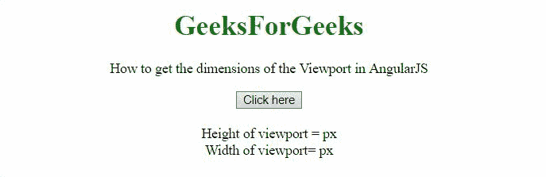
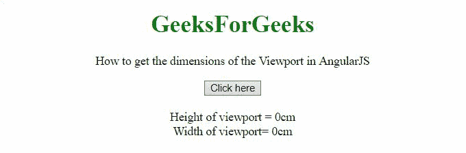

# 如何用 AngularJS 获取视口的尺寸？

> 原文:[https://www . geeksforgeeks . org/如何使用-angularjs/](https://www.geeksforgeeks.org/how-to-get-the-dimensions-of-the-viewport-using-angularjs/) 获取视口尺寸

在本文中，我们将看到如何在 AngularJS 中获得视口的尺寸。

**进场:**

*   方法是使用 **clientWidth 和 innerWidth 属性。**
*   这些值的最大值应该分别是宽度和高度。

**示例 1:** 在本示例中，**高度和宽度**以像素为单位计算。

## 超文本标记语言

```tshtml
<!DOCTYPE HTML> 
<html>

<head>
    <script src=
"https://ajax.googleapis.com/ajax/libs/angularjs/1.2.13/angular.min.js">
    </script>

    <script>
        var myApp = angular.module("app", []);
            myApp.controller("controller", function($scope) {
            $scope.height = '';
            $scope.width = '';
            $scope.getVPDimnsn = function() {    
                $scope.width = 
                    Math.max(document.documentElement.clientWidth,
                            window.innerWidth || 0)
                $scope.height = 
                    Math.max(document.documentElement.clientHeight,
                            window.innerHeight || 0)
                };
            });
    </script>
</head> 

<body style="text-align:center;">
    <h1 style="color:green;">  
        GeeksForGeeks  
    </h1> 

    <p>
        How to get the dimensions of the 
        Viewport in AngularJS
    </p>

    <div ng-app="app">  
        <div ng-controller="controller">
            <button ng-click='getVPDimnsn()' >
                Click here
            </button>
            <br><br>
            Height of viewport = {{height}}px
            <br>
            Width of viewport= {{width}}px
            <br>
        </div> 
    </div>
</body>   

</html>
```

**输出:**



**例 2:** 在本例中，**的高度和宽度**以厘米为单位计算。

## 超文本标记语言

```tshtml
<!DOCTYPE HTML> 
<html>

<head>
    <script src=
"https://ajax.googleapis.com/ajax/libs/angularjs/1.2.13/angular.min.js">
    </script>

    <script>
        var myApp = angular.module("app", []);
            myApp.controller("controller", function($scope) {
            $scope.height = '';
            $scope.width = '';
            $scope.getVPDimnsn = function() {    
                $scope.width = 
                    Math.max(document.documentElement.clientWidth,
                            window.innerWidth || 0)
                $scope.height = 
                    Math.max(document.documentElement.clientHeight,
                            window.innerHeight || 0)
                };
            });
    </script>
</head> 

<body style="text-align:center;">
    <h1 style="color:green;">  
        GeeksForGeeks  
    </h1> 

<p>
        How to get the dimensions of the Viewport in AngularJS
    </p>

    <div ng-app="app">  
        <div ng-controller="controller">
            <button ng-click='getVPDimnsn()' >
                Click here
            </button>
            <br>
            <br>
            Height of viewport = {{height * 2.54 / 96}}cm
            <br>
            Width of viewport= {{width * 2.54 / 96}}cm
            <br>
        </div> 
    </div>
</body>   

</html>
```

**输出:**

