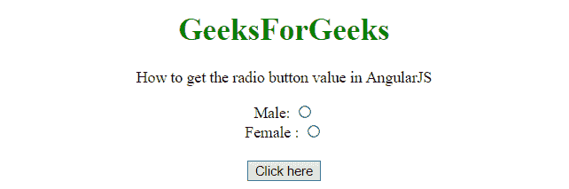
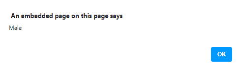
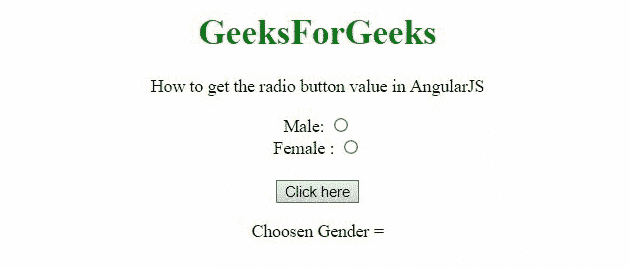

# 如何使用 AngularJS 获取单选按钮的值？

> 原文:[https://www . geeksforgeeks . org/如何使用-angularjs/](https://www.geeksforgeeks.org/how-to-get-the-value-of-radio-button-using-angularjs/) 获取单选按钮的价值

在本文中，我们将看到如何在 AngularJS 的帮助下获取单选按钮的值。在本文中，我们将使用 **ng-model** 来获取**选中的**单选按钮的值。

**示例 1:** 在此示例中，所选值显示为带有警报。

## 超文本标记语言

```tshtml
<!DOCTYPE HTML>
<html>

<head>
    <script src=
"https://ajax.googleapis.com/ajax/libs/angularjs/1.2.13/angular.min.js">
    </script>

    <script>
        var myApp = angular.module("app", []);
        myApp.controller("controller", function ($scope) {
            $scope.selectedGender = '';
            $scope.getVal = function (gender) {
                alert(gender);
            };
        });
    </script>
</head>

<body style="text-align:center;">
    <h1 style="color:green;">
        GeeksForGeeks
    </h1>

    <p>
        How to get the radio button 
        value in AngularJS
    </p>

    <div ng-app="app">
        <div ng-controller="controller">
            <form action="javascript:void(0)">
                Male: <input type="radio" 
                    name="userGender" 
                    ng-model='gender' 
                    value="Male" />
                <br>
                Female : <input type="radio" 
                    name="userGender" 
                    ng-model='gender' 
                    value="Female" />
                <br>

                <br>
                <button ng-click="getVal(gender)">
                    Click here
                </button>
            </form>
        </div>
    </div>
</body>

</html>
```

**输出:**

*   **点击按钮前:**



*   **点击按钮后:**



**示例 2:** 在本示例中，所选值显示在< p >标签中。

## 超文本标记语言

```tshtml
<!DOCTYPE HTML>
<html>

<head>
    <script src=
"https://ajax.googleapis.com/ajax/libs/angularjs/1.2.13/angular.min.js">
    </script>

    <script>
        var myApp = angular.module("app", []);
        myApp.controller("controller", function ($scope) {
            $scope.selGender = '';
            $scope.getVal = function (gender) {
                $scope.selGender = angular.copy(gender);
            };
        });
    </script>
</head>

<body style="text-align:center;">
    <h1 style="color:green;">
        GeeksForGeeks
    </h1>

    <p>
        How to get the radio button 
        value in AngularJS
    </p>

    <div ng-app="app">
        <div ng-controller="controller">
            <form action="javascript:void(0)">
                Male: <input type="radio" 
                    name="userGender" 
                    ng-model='gender' 
                    value="Male" />
                <br>
                Female : <input type="radio" 
                    name="userGender" 
                    ng-model='gender' 
                    value="Female" />
                <br>

                <br>
                <button ng-click="getVal(gender)">
                    Click here
                </button>
            </form>

            <p>Choosen Gender = {{selGender}}</p>
        </div>
    </div>
</body>

</html>
```

**输出:**

