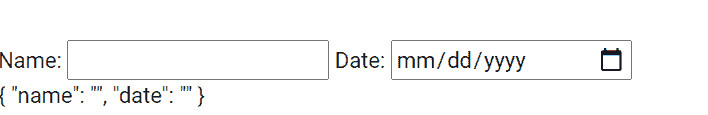

# 如何在 Angular 中得到形体的值？

> 原文:[https://www . geeksforgeeks . org/如何获得角形的价值/](https://www.geeksforgeeks.org/how-to-get-the-value-of-the-form-in-angular/)

在本文中，我们将看到如何从 Angular 10 中的表单获取值。我们将使用抽象控制值属性来获取对象中的表单值。

**语法:**

```
form.value
```

**返回值:**

*   **对象:**是包含形态值的对象

**进场:**

*   创建要使用的角度应用程序
*   在 app.component.html，使用表单指令制作表单。
*   现在使用抽象控制值属性获取该值
*   使用 ng serve 为 angular app 服务，以查看输出。

**例 1:**

## app.component.ts

```
import { NgModule } from '@angular/core';

// Importing forms module
import { FormsModule } from '@angular/forms';
import { BrowserModule } from '@angular/platform-browser';
import { BrowserAnimationsModule } from '@angular/platform-browser/animations';

import { AppComponent }   from './app.component';

@NgModule({
  bootstrap: [
    AppComponent
  ],
  declarations: [
    AppComponent
  ],
  imports: [
    FormsModule,
    BrowserModule,
    BrowserAnimationsModule,

  ]
})
export class AppModule { }
```

## app.component.html

```
<form #gfg = "ngForm">

    <br>
    <br>
    Name: <input type="text" name = 'name' ngModel>
    Date: <input type="date" name = 'date' ngModel>
</form>
{{ gfg.value | json }}
```

**输出:**



**参考:**T2】https://angular.io/api/forms/AbstractControlDirective#value