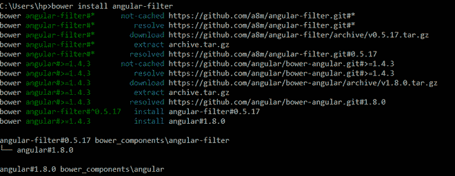

# 如何用 Angular 过滤器对数据进行分组？

> 原文:[https://www . geeksforgeeks . org/如何使用角度过滤器对数据进行分组/](https://www.geeksforgeeks.org/how-to-group-data-with-angular-filter/)

任务是展示如何使用角度过滤器对数据进行分组。

**涉及的步骤:**

1.您可以使用以下四种不同的方法安装角度过滤器:

*   克隆并构建[https://github.com/a8m/angular-filter](https://github.com/a8m/angular-filter)git 资源库


*   Via Bower:通过运行 **$ bower 从您的终端安装角度过滤器**

  

*   通过 npm:通过运行 **$ npm，从您的终端安装角度过滤器**。


通过 npm 安装


*   通过 cdnjs:将以下脚本-src 添加到您的应用程序中。


2.如下例所示，在包含 angular 本身之后，在您的 index.html 中包含 angular-filter.js(或 angular-filter.min.js)。

3.将“angular.filter”添加到主模块的依赖列表中。

**示例:**在本例中，我们将使用角度过滤器按品种对狗进行分组。

## 超文本标记语言

```html
<!DOCTYPE html>
<html>

<head>
    <script src=
"https://ajax.googleapis.com/ajax/libs/angularjs/1.4.0/angular.min.js">
    </script>

    <script src=
"https://cdnjs.cloudflare.com/ajax/libs/angular-filter/0.5.7/angular-filter.js">
    </script>

    <link rel="stylesheet" href=
        "https://www.w3schools.com/w3css/4/w3.css">
    <meta charset="utf-8">
</head>

<body ng-app="myApp" ng-controller="myCtrl">

    <p class="w3-jumbo w3-text-green pad" 
        align="center" style="margin: 0 0 0 0">
        GeeksforGeeks
    </p>

    <p class="w3-large w3-text-green pad" 
        align="center">
        A computer science portal for geeks
    </p>

    <ul>
        <li ng-repeat=
            "(key, value) in dogs | groupBy:'breed'">
            Breed: {{ key }}
            <ol>
                <li ng-repeat="dog in value">
                    Dog name: {{ dog.name }}
                </li>
            </ol>
        </li>
    </ul>

    <script type="text/javascript">
        //(3)
        angular.module('myApp', ['angular.filter'])
            .controller('myCtrl', function ($scope) {
            $scope.dogs = [
                { name: 'Alex', breed: 'German Shepherd' },
                { name: 'Rocky', breed: 'Bulldog' },
                { name: 'John', breed: 'Beagle' },
                { name: 'Paula', breed: 'Bulldog' },
                { name: 'Bobby', breed: 'German Shepherd' }
            ];
        });
    </script>
</body>

</html>
```

**输出:**

