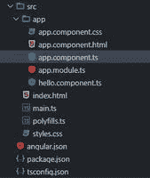
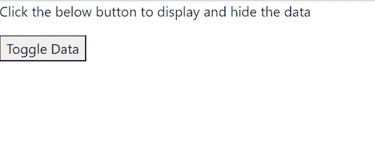

# 如何在 AngularJS 中通过按钮点击隐藏一个 HTML 元素？

> 原文:[https://www . geesforgeks . org/how-hide-a-html-element-via-button-click-in-angularjs/](https://www.geeksforgeeks.org/how-to-hide-an-html-element-via-a-button-click-in-angularjs/)

在本文中，我们将看到如何使用切换按钮功能，通过在 Angular 中单击按钮来隐藏和显示元素。切换按钮是一个用户界面控件，对于用户想要在两种状态或条件之间切换的情况可能很有用。例如，在我们的智能手机中，我们通常会关闭/打开蓝牙、Wifi、飞机模式等无线连接设备的按钮。这种切换按钮使日常生活中的东西更容易使用。本文将展示如何使用 Angular JS 制作一个切换数据按钮。

**[ngif 指令](https://www.geeksforgeeks.org/angularjs-ng-if-directive/):**ngIf 是一个 Angular 结构指令，它根据表达式求值的值创建一个模板。表达式的值应该始终是*真*或*假*。当模板内的表达式评估为真时，渲染*和*块内的代码块，而当表达式评估为假时，渲染可选的*或*块。
**语法:**

```
<div *ngIf = "condition">Content to render when condition is true.</div>
```

对于*app.component.html*文件，我们将使用这个 toggleData()函数来调用 Html 中的函数

```
<button (click)="toggleData()">Toggle Data</button>
```

对于 *app.component.ts* 文件，我们定义了一个切换按钮显示或隐藏内容的功能。

```
export class AppComponent {
 toDisplay = true;

 toggleData() {
   this.toDisplay = !this.toDisplay;
 }
}
```

**进场:**

*   首先，将内容包装在一个 Html 文件的标签中。
*   现在取一个变量“**来显示**，并将其绑定到< div >标签。
*   在一个 HTML 文件中，包含一个按钮，并在用户点击它时附加一个函数调用。
*   在 ts 文件中，实现函数，现在在真和假之间切换**到显示**变量。
*   完成上述实现后，启动应用程序

**项目结构:**如下图所示



**示例:**

## app.component.html

```
<div *ngIf="toDisplay">
  <p>Click the below button to display and hide the data</p>
</div>
<button (click)="toggleData()">Toggle Data</button>
```

## app.component.ts

```
import { Component } from "@angular/core";

@Component({
  selector: "my-app",
  templateUrl: "./app.component.html",
})
export class AppComponent {
  toDisplay = true;

  toggleData() {
    this.toDisplay = !this.toDisplay;
  }
}
```

**输出:**从上面的输出中，我们可以看到通过点击切换数据按钮，我们可以显示或隐藏数据。

