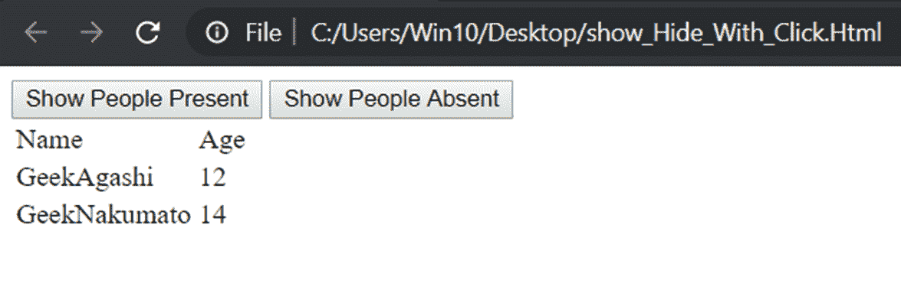
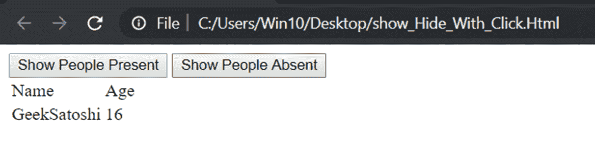

# 如何基于 ng-click 隐藏或显示表格中 ng-repeat 的一条记录？

> 原文:[https://www . geeksforgeeks . org/如何隐藏或显示表格中的一条记录-基于 ng-click 的重复/](https://www.geeksforgeeks.org/how-to-hide-or-show-one-record-from-an-ng-repeat-within-a-table-based-on-ng-click/)

隐藏或显示表中特定记录的方式类似于隐藏或显示 DOM 中任何元素的方式。首先想到的基本指令是 **ng-show** 和 **ng-hide** 指令，它们分别基于绑定到它们的表达式的二进制结果来显示或隐藏。另一种方法是使用
**ng-if** ，这在一般编程中类似于 if 块。如果表达式为真，元素是否可见。
通过 ng-click 命令可以很容易地控制这一点，ng-click 命令可以用来调用一个函数或运行一段代码来操作布尔表达式中的实体。

**方法 1:** 这里，只有当绑定到 ng-show 的表达式为真时，tr 元素才可见。
这里的 ng-hide 在示例中被注释掉了，但它的工作方式与 ng-show 相同。不同的是，如果布尔表达式给出真值，它会隐藏 tr 元素。
ng-show 和 ng-hide 指令都可以有常规的函数调用，但是它们应该返回一个布尔值。

**语法:**

```
< tr ng-repeat="x in [some list]" ng-show="[some boolean expression]" > < tr >
< tr ng-repeat="x in [some list]" ng-hide="[some boolean expression]" > < tr >

```

**示例:**

```
<!DOCTYPE html>
<html>

<head>
    <title>
      Angular show hide table element on click
  </title>
    <script src=
"https://ajax.googleapis.com/ajax/libs/angularjs/1.3.14/angular.min.js">
    </script>
</head>

<body>
    <div ng-app="mainApp" ng-controller="MyCtrl">
        <button ng-click="showPresent()">
          Show People Present
      </button>
        <button ng-click="showAbsent()">
          Show People Absent
      </button>
        <table>
            <tr>
                <td>Name</td>
                <td>Age</td>
            </tr>
            <!-- The next two lines are interchangeable -->
            <!-- <tr ng-repeat="p in people" ng-hide="p.attended!=flag"></tr> -->
            <tr ng-repeat="p in people" ng-show="p.attended==flag">
                <td>{{p.name}}</td>
                <td>{{p.Age}}</td>
            </tr>
        </table>
    </div>
    <script>
        var app = angular.module("mainApp", []);
        app.controller("MyCtrl", function($scope) {
            $scope.flag = 1;
            $scope.people = [{
                name: "GeekAgashi",
                Age: 12,
                attended: 1
            }, {
                name: "GeekSatoshi",
                Age: 16,
                attended: 0
            }, {
                name: "GeekNakumato",
                Age: 14,
                attended: 1
            }];
            $scope.showPresent = function() {
                $scope.flag = 1;
            };
            $scope.showAbsent = function() {
                $scope.flag = 0;
            };
        });
    </script>

</body>

</html>
```

**输出:**

*   当点击“显示出席人员”时，布尔型为真，适用于所有出席值与标志值匹配的对象，因为它通过从 ng-click:
    调用变为 1
*   当点击“显示缺席人员”时，所有关注值与标志值匹配的对象的布尔值为真，因为它通过 ng-click 调用变为 0:
    

**方法 2:** 这里我们使用 ngIf 来显示或隐藏表的记录。代码保持不变，因为工作几乎相同。但是 ngIf 不如 ng-show 或 ng-hide 可靠，但是它的作用是从 DOM 中完全移除元素。

**Syantax:**

```
< tr ng-repeat="x in [some list]" ng-if="[some boolean expression]" > < tr >
```

**示例:**

```
<!DOCTYPE html>
<html>

<head>
    <title>Angular show or hide element on click</title>
    <script src=
"https://ajax.googleapis.com/ajax/libs/angularjs/1.3.14/angular.min.js">
    </script>
</head>

<body>
    <div ng-app="mainApp" ng-controller="MyCtrl">
        <button ng-click="showPresent()">
          Show People Present
      </button>
        <button ng-click="showAbsent()">
          Show People Absent
      </button>
        <table>
            <tr>
                <td>Name</td>
                <td>Age</td>
            </tr>
            <!--The main change in the code is in the next line-->
            <tr ng-repeat="p in people"
                ng-if="p.attended==flag">
                <td>{{p.name}}</td>
                <td>{{p.Age}}</td>
            </tr>
        </table>
    </div>
    <script>
        var app = angular.module("mainApp", []);
        app.controller("MyCtrl", function($scope) {
            $scope.flag = 1;
            $scope.people = [{
                name: "GeekAgashi",
                Age: 12,
                attended: 1
            }, {
                name: "GeekSatoshi",
                Age: 16,
                attended: 0
            }, {
                name: "GeekNakumato",
                Age: 14,
                attended: 1
            }];
            $scope.showPresent = function() {
                $scope.flag = 1;
            };
            $scope.showAbsent = function() {
                $scope.flag = 0;
            };
        });
    </script>

</body>

</html>
```

**输出:**

*   输出保持不变，因为它们都以相同的方式工作:
    
*   