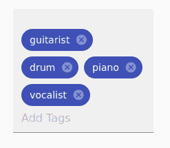

# 如何在 Angular 9 应用中实现‘添加标签’功能？

> 原文:[https://www . geeksforgeeks . org/如何实现-添加-标记-功能-in-an-angular-9-app/](https://www.geeksforgeeks.org/how-to-implement-add-tag-functionality-in-an-angular-9-app/)

Angular 使几乎所有功能的实现变得非常容易。在本文中，我们将学习如何在您的 angular 应用程序中实现添加标签功能。添加标签在音乐应用、在线购物应用等多个领域都有应用。通过使用该功能，我们可以根据用户的需要过滤搜索结果。

**进场:**

*   Angular 素材库提供 **mat-chip，**可用于实现该功能。
*   我们可以在表单域中使用它来接收用户的输入并更新我们的标签列表。
*   一旦用户添加完标签，我们就可以保存标签列表。
*   现在我们有了标签列表，我们可以用任何我们想要的方式使用它。

**分步实施:**

对于组件类:

*   从**@角度/材料/芯片**导入**匹配事件**处理标签输入事件。
*   从 **@angular/cdk/keycodes** 导入**逗号**、**回车**添加分隔符键。
*   创建一个包含用户输入的所有标签的列表。
*   创建您的自定义添加和删除方法来添加和删除标签。
*   组件的代码:

```
import {Component} from '@angular/core';
import {COMMA, ENTER} from '@angular/cdk/keycodes';
import {MatChipInputEvent} from '@angular/material/chips';

@Component({
  selector: 'add-tags',
  templateUrl: 'tags.html',
  styleUrls: ['tags.css'],
})
export class addTags {

/*Set the values of these properties
    to use them in the HTML view.*/

  visible = true;
  selectable = true;
  removable = true;

/*set the separator keys.*/

  readonly separatorKeysCodes: number[] = [ENTER, COMMA];

/*create the tags list.*/

  Tags: string[] = [];

/*our custom add method which will take
    matChipInputTokenEnd event as input.*/
  add(event: MatChipInputEvent): void {

/*we will store the input and value in local variables.*/

    const input = event.input;
    const value = event.value;

    if ((value || '').trim()) {

 /*the input string will be pushed to the tag list.*/

      this.Tags.push(value);
    }

    if (input) {

/*after storing the input we will clear the input field.*/

      input.value = '';
    }
  }

/*custom method to remove a tag.*/

  remove(tag: string): void {
    const index = this.Tags.indexOf(tag);

    if (index >= 0) 
    {

/*the tag of a particular index is removed from the tag list.*/

      this.Tags.splice(index, 1);
    }
  }
}
```

对于 HTML 视图:

*   创建一个接受输入并显示标签列表的表单域。
*   有一些参数:
    1。 **matChipInputFor:** 它采用表单域的 id，我们将从其中输入标签。
    2。**matchipinputseparateworkycodes:**它接受将用作分隔符的键的值。
    3 **。matChipInputTokenEnd:** 用户一按分隔符键，这将包含最后输入的标签，我们可以通过自定义的 add 方法更新标签列表。
*   要删除一个特定的标签，添加一个 matChipRemove 指令的 mat-icon。
*   HTML 视图的代码:

```
<!DOCTYPE html>
<html>
    <head>
        <title>tutorial</title>
    </head>
    <body>
        <mat-form-field class="input">
            <!--this contains the list of tags-->

            <mat-chip-list #taglist>
                <!--set the properties for the tags-->

                <mat-chip selected color="primary" 
                          *ngFor="let Tag of Tags" 
                          [selectable]="selectable" 
                          [removable]="removable" 
                          (removed)="remove(Tag)">
                    {{Tag}}
                    <!--add icon with matChipRemove 
                           directive to remove any tag-->

                    <mat-icon matChipRemove
                              *ngIf="removable">cancel
                  </mat-icon>
                </mat-chip>
                <input placeholder="Add Tags"
                       [matChipInputFor]="taglist"
              [matChipInputSeparatorKeyCodes]="separatorKeysCodes" 
                       (matChipInputTokenEnd)="add($event)" />
            </mat-chip-list>
        </mat-form-field>
    </body>
</html>
```

*   现在在主要组件中包括这个“添加标签”组件。

```
import {Component} from '@angular/core';

@Component({
  selector: 'app-root',
  template: `
  <div style="align-items: center;">
  <app-test></app-test>
  </div>
  `,
  styleUrls: ['main.css'],
})

export class AppComponent {

}
```

*   我们已经成功实现了添加标签功能。

**输出:**表单字段上的 Mat-chips 表示用户输入的标签。

