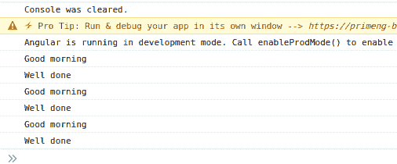

# 如何在 angular 6 组件中注入服务？

> 原文:[https://www . geeksforgeeks . org/如何将服务注入 6 角组件/](https://www.geeksforgeeks.org/how-to-inject-service-in-angular-6-component/)

服务是 Angular 中的一个特殊类，主要用于组件间的通信。有时，有些组件需要一个公共池来相互交互，主要是为了获取数据或信息。服务使之成为可能。这两个(或多个)组件可能相互关联，也可能不关联。这意味着可能存在亲子关系，或者根本不存在。

服务和其他依赖项被直接注入到组件的构造函数中，如下所示:

```ts
constructor(private _myService: MyService) {
}
```

通过这样做，我们实际上是在创建一个服务实例。这意味着我们必须访问服务的所有公共变量和方法。

要创建新服务，我们可以使用代码支架工具:

```ts
// Generate service
ng g s my-custom-service
```

将服务注入组件非常简单。假设我们有一个名为 *MyCustomService* 的服务。我们可以这样把它注入到一个组件中:

## MyCustomComponent.ts

```ts
import {...} from "@angular/core";
import { MyCustomService } from "../...PATH";

@Component({
  selector: "...",
  templateUrl: "...",
  styleUrls: ["..."],
})
export class MyCustomComponent {

    // INJECTING SERVICE INTO THE CONSTRUCTOR
    constructor(private _myCustomService: MyCustomService) {}

      // USING THE SERVICE MEMBERS
    this._myCustomService.sampleMethod();
}
```

这可能没有任何意义，除非我们把手弄脏。因此，让我们快速创建一个服务，看看它是如何被注入的，以及如何被轻松访问。对于这个演示，我们将创建两个简单的自定义组件。让我们说，女士们先生们。这两个组件之间没有父子关系。两者是绝对独立的。先生们会用“早上好”来问候女士们。为此，我们将使用一个在两个组件之间交互的服务。我们称之为交互服务。

首先，我们将创建我们的 2 个组件和 1 个服务。

现在我们拥有了我们需要的一切。因为这个演示特别针对服务注入。我们将不详细讨论组件。我们先从服务开始。下面是代码:

## interaction.service.ts

```ts
import { Injectable } from '@angular/core';
import { Subject } from 'rxjs';

@Injectable({
  providedIn: 'root'
})
export class InteractionService {
  private _messageSource = new Subject<string>();

  greeting$=this._messageSource.asObservable();

  sendMessage(message: string) {
    this._messageSource.next(message);
  }
}
```

已经完成了。我们现在将把这项服务注入到我们的两个组件中。

## gentlemen.component.html

```ts
<!DOCTYPE html>
<html>
  <head>
      <title>Page Title</title>
  </head>
  <body>
      <h2>Welcome To GFG</h2>
      <button (click)="greetLadies()">Greet</button>
  </body>
</html>
```

我们现在将使用以下命令创建第一个组件:

```ts
// Generate component
ng g c gentlemen
```

## 先生们。组件。ts

```ts
import {...} from "@angular/core";
...
import { InteractionService } from "../services/interaction.service";

@Component({
  selector: "app-gentlemen",
  templateUrl: "./gentlemen.component.html",
  styleUrls: ["./gentlemen.component.scss"],
})
export class GentlemenComponent {

  // SERVICE INJECTION
  constructor(private _interactionService: InteractionService) {}

  greetLadies() {
    this._interactionService.sendMessage("Good morning");
  }
}
```

快速创建我们的最后一个组件:

```ts
// Generate component
ng g c ladies
```

## 女士。组件。ts

```ts
import {...} from "@angular/core";
...
import { InteractionService } from "../services/interaction.service";

@Component({
  selector: "app-ladies",
  templateUrl: "./ladies.component.html",
  styleUrls: ["./ladies.component.scss"],
})
export class LadiesComponent implements OnInit {

  // SERVICE INJECTION
  constructor(private _interactionService: InteractionService) {}

  ngOnInit() {
    this._interactionService.greeting$.subscribe(message => {
      console.log(message);
    })
  }
}
```

这就是我们如何注入和使用服务来在组件之间进行交互。我们刚刚看到了一个服务注入的用例。

我们将把这个作为我们的最终产品:


UI/UX 屏幕快照

点击按钮，我们可以预期以下输出:



预期产出