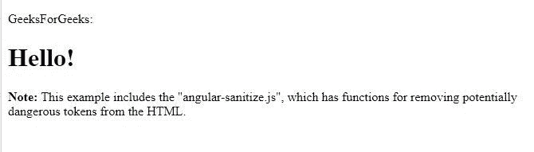
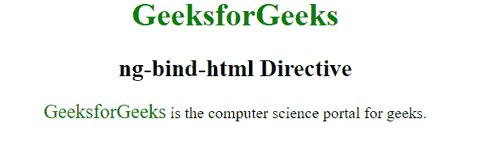

# 如何从 AngularJS 控制器将 HTML 插入视图？

> 原文:[https://www . geeksforgeeks . org/如何从 angularjs-controller/](https://www.geeksforgeeks.org/how-to-insert-html-into-view-from-angularjs-controller/) 将 html 插入视图

**[ng-bind-html](https://www.geeksforgeeks.org/angularjs-ng-bind-html-directive/)** 指令是一种将内容绑定到 html 元素的安全方式。因此，为了将 HTML 插入视图，我们使用了各自的指令。

在使用 AngularJS 时，在我们相应的应用程序中编写 HTML，我们应该检查 HTML 中是否有危险或容易出错的代码。通过在应用程序中包含**“angular-sanitize . js”**模块，我们可以通过**运行 HTML 代码来实现。**

**语法:**

```ts
<element ng-bind-html="expression"></element>
```

**名词化:**
**它由 2 个步骤组成:**

*   包括

    ```ts
    <script src="lib/angular/angular-sanitize.min.js"></script>
    ```

    资源
*   在一个 js 文件(控制器或者通常是 app.js)中，我们必须包含 ngSanitize，

    ```ts
    angular.module('myApp', ['myApp.filters', 'myApp.services', 
    'myApp.directives', 'ngSanitize'])
    ```

**参数:**

*   **表达式:**指定计算的表达式或值。

**例 1:**

```ts
<html>
<script src=
"https://ajax.googleapis.com/ajax/libs/angularjs/1.6.9/angular.min.js">
  </script>
<script src=
"https://ajax.googleapis.com/ajax/libs/angularjs/1.6.9/angular-sanitize.js">
  </script>

<body>

    <div ng-app="myApp" 
         ng-controller="myCtrl">

        <p ng-bind-html="myText">
      </p>

    </div>

    <script>
        var app = angular.module("myApp", ['ngSanitize']);
        app.controller("myCtrl", function($scope) {
            $scope.myText = "GeeksForGeeks: <h1>Hello!</h1>";
        });
    </script>

    <p><b>Note:</b> This example includes the "angular-sanitize.js",
      which has functions for removing potentially 
      dangerous tokens from the HTML.</p>

</body>

</html>
```

**输出:**


**例 2:**

```ts
<!DOCTYPE html> 
<html ng-app="myApp"> 

<head> 
    <title>ng-bind-html Directive</title> 

    <script src= 
"//ajax.googleapis.com/ajax/libs/angularjs/1.3.2/angular.min.js"> 
    </script> 
    <script src= 
"//ajax.googleapis.com/ajax/libs/angularjs/1.3.2/angular-sanitize.min.js"> 
    </script> 

    <style> 
        .green { 
            color: green; 
            font-size: 20px; 
        } 
    </style> 
</head> 

<body ng-controller="geek" style="text-align:center"> 

    <h1 style="color:green;">GeeksforGeeks</h1> 
    <h2 style="">ng-bind-html Directive</h2> 

    <p ng-bind-html="text"></p> 

    <script> 
        var myApp = angular.module("myApp", ['ngSanitize']); 

        myApp.controller("geek", ["$scope", function($scope) { 
            $scope.text = 
            "<span class='green'> GeeksforGeeks</span> is the" 
            + " computer science portal for geeks."; 
        }]); 
    </script> 
</body> 

</html>         
```

**输出:**
