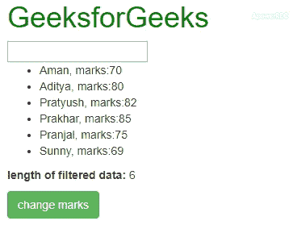

# 如何在 AngularJS 中迭代对象的过滤(ng-repeat filter)集合？

> 原文:[https://www . geeksforgeeks . org/如何迭代-过滤-ng-重复-过滤-对象集合-in-angularjs/](https://www.geeksforgeeks.org/how-to-iterate-over-filtered-ng-repeat-filter-collection-of-objects-in-angularjs/)

任务是迭代一个已经被 ng-repeat 过滤器过滤的对象集合，在点击一个按钮后，只改变那些被过滤的对象的一些属性。假设您有一个对象集合，这些对象是通过文本搜索在每个对象的 title 属性中进行筛选的。现在，您希望在单击分配的按钮并更改与此筛选器匹配的项的属性后，遍历列表的这个子集。

为了迭代已经被 ng-repeat 过滤器过滤的对象集合，我们使用一个别名表达式。我们为用于过滤 ng-repeat 数据的变量创建一个别名。当单击按钮时，该别名变量被传递给 Angular 函数()。现在，在 AngularJS 函数中，由于别名变量只包含那些被过滤的对象的值，所以我们迭代这些值。对于每一次迭代，我们改变一些属性，比如在这种情况下，过滤学生的分数为 10，然后控制这些值。

**语法:**

> <element ng-repeat="”expression" filter:="" search="" as="" result="">内容……</element>
> <脚本> result.forEach(函数(学生){ student . marks+= 10；});<脚本>

以下示例说明了上述方法:

**示例:**在本例中，我们正在显示学生的详细信息，并且有一个搜索框可以按学生的姓名进行搜索。现在，我们将搜索框的输入绑定到 AngularJS **searchName** 变量中。SearchName 变量用于过滤，我们为它创建一个别名，它就是这里的结果，然后当我们点击 change marks 按钮 **changemarks()** 函数被调用，结果别名变量作为参数传递。现在，在 **changemarks()** 函数中，我们将每个被过滤的学生的分数增加 10。因此，通过点击“更改标记”按钮，我们只更改了那些已经被过滤的学生的标记属性。

```ts
<!DOCTYPE html>
<html>

<head>  
    <title>
        Angular JS Iteration Over Filtered Data
    </title>
    <link rel="stylesheet" href=
"https://maxcdn.bootstrapcdn.com/bootstrap/3.4.1/css/bootstrap.min.css">
    <script src=
"https://ajax.googleapis.com/ajax/libs/angularjs/1.3.14/angular.min.js">
    </script>
</head>

<body style="margin: 10px;">
    <h1 style="color:green;"> 
        GeeksforGeeks 
    </h1>

    <div ng-app="mainApp" ng-controller="studentController">
        <input type="text" ng-model="searchName">
        <br/>

        <ul>
            <li ng-repeat="student in students 
               | filter: searchName as result">
                {{ student.name + ', marks:' + student.marks }}
            </li>
        </ul>
        <p><b>length of filtered data:</b> {{ result.length }}</p>
        <buuton type="button" class="btn btn-success" 
                ng-click="changemarks(result)">change marks</button>
    </div>

    <script>
        var mainApp = angular.module("mainApp", []);

        mainApp.controller('studentController', function($scope) {
            $scope.students = [{
                name: 'Aman',
                marks: 70
            }, {
                name: 'Aditya',
                marks: 80
            }, {
                name: 'Pratyush',
                marks: 82
            }, {
                name: 'Prakhar',
                marks: 85
            }, {
                name: 'Pranjal',
                marks: 75
            }, {
                name: 'Sunny',
                marks: 69
            }];
            $scope.changemarks = function(values) {
                angular.forEach(values, function(value, key) {
                    value.marks += 10;
                    console.log(value.name + ' ' + value.marks);
                });
            };
        });
    </script>
</body>

</html>
```

**输出:**
