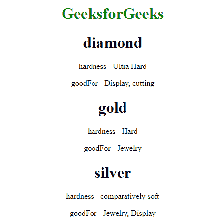

# 如何在 AngularJS 中用 ng-repeat 迭代键和值？

> 原文:[https://www . geeksforgeeks . org/如何用 ng-repeat-in-angularjs 迭代键和值/](https://www.geeksforgeeks.org/how-to-iterate-over-the-keys-and-values-with-ng-repeat-in-angularjs/)

任务是使用 ng-repeat 指令迭代 JS 对象(它的键和值)。这可以通过使用 ng-repeat 指令中的括号来明确要求 angularJS 提供一个键值对参数来实现。这里，变量键包含对象的键，值包含对象的值。

**语法:**

```
<element ng-repeat="(key, value) in JSObject"> Contents... </element>
```

**示例 1:** 在本例中，我们将使用 ng-repeat 简单地显示一个 JS 对象的所有键和值。在第一次迭代中，key = name and value =“geeks forgeeks”。在第二次迭代中，key = location and value =“Noida India Sector 136”…这将继续迭代，直到所有的键及其值至少被覆盖一次，类似于 for-each 循环。

*   **程序:**

    ```
    <!DOCTYPE html>
    <html ng-app="myApp">

    <head>
        <script src=
    "https://ajax.googleapis.com/ajax/libs/angularjs/1.7.8/angular.min.js">
        </script>
    </head>

    <body ng-controller="MyController">
        <center>
            <h1 style="color: green;">
                GeeksforGeeks
            </h1>
            <div ng-repeat="(key, value) in gfg">

                <!-- First Iteration-->
                <p>{{key}} - {{value}}</p>
            </div>
        </center>
    </body>
    <script type="text/javascript">
        var myApp = angular.module('myApp', []);
        myApp.controller('MyController', ['$scope', function($scope) {
            $scope.gfg = {
                Name: "GeeksforGeeks",
                Location: "Noida India Sector 136",
                Type: "Edu-Tech",
            }
        }]);
    </script>

    </html>
    ```

*   **输出:**在加载页面时，我们看到对象的所有键值对都已经列在那里了。这是因为加载 HTML 时会调用 ng-repeat。
    T3】

**示例 2:** 在本例中，我们将使用 ng-repeat 指令在嵌套对象上循环。在第一次迭代中，key =钻石和值= {硬度:“超硬”，goodFor:“显示，切割”}在下一次迭代中 key =黄金和值是其各自的对象。这就像在对象材料的键值对上的 for-each 循环一样不断迭代。

*   **程序:**

    ```
    <!DOCTYPE html>
    <html ng-app="myApp">

    <head>
        <script src=
    "https://ajax.googleapis.com/ajax/libs/angularjs/1.7.8/angular.min.js">
        </script>
    </head>

    <body ng-controller="MyController">
        <center>
            <h1 style="color: green;">
                GeeksforGeeks
            </h1>
            <div ng-repeat="(key, value) in materials">

                <h1>{{key}}</h1>
                <div ng-repeat="(key1, value1) in value">

                    <!-- since the "value" variable itself is
                     an object. We can iterate over its keys
                     and values again using ng-repeat.  -->
                    <p>{{key1}} - {{value1}}</p>
                </div>
            </div>
        </center>
    </body>
    <script type="text/javascript">
        var myApp = angular.module('myApp', []);
        myApp.controller('MyController', ['$scope', function($scope) {
            $scope.materials = {
                diamond: {
                    hardness: "Ultra Hard",
                    goodFor: "Display, cutting"
                },
                gold: {
                    hardness: "Hard",
                    goodFor: "Jewelry"
                },
                silver: {
                    hardness: "comparatively soft",
                    goodFor: "Jewelry, Display"
                }
            }
        }]);
    </script>

    </html>
    ```

*   **输出:**
    