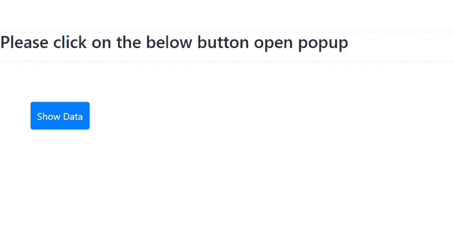

# 如何在 Angular 9/8 中制作引导模式弹出？

> 原文:[https://www . geeksforgeeks . org/如何进行引导-模式-角度弹出-9-8/](https://www.geeksforgeeks.org/how-to-make-a-bootstrap-modal-popup-in-angular-9-8/)

在本文中，我们将看到如何在 Angular 应用程序中使用 bootstrap 的模态弹出组件。在我们的 Angular 项目中添加 bootstrap 是一个简单的过程。模式对话框可用于限制用户在恢复正常使用应用程序之前执行特定的操作。例如，如果用户想要访问某个应用程序，那么他们必须先登录该应用程序，然后才能访问整个应用程序&我们不想让用户直接访问该应用程序或任何网站。在这里，模式窗口/弹出窗口可以是一个有用的东西来限制做一些改变。随着本文的深入，我们将能够构建自己的模态弹出窗口。

如果您想使用 NgbModal 模块使用 bootstrap & Angular 打开弹出窗口，请参考[如何使用 Angular 和 bootstrap 打开弹出窗口？](https://www.geeksforgeeks.org/how-to-open-popup-using-angular-and-bootstrap/)
我们将按照以下步骤制作这个项目。

**步骤 1:** 使用以下命令安装引导程序。为了使用引导程序，首先，我们需要使用下面的语法将其安装在我们的工作区中。节点包管理器方便我们安装项目中需要的各种包。

```
npm install bootstrap
```

**第二步:**在 styles.css 文件中包含下面一行。在我们的项目&中打开 src/style . CSS文件，通过添加下面一行代码，导入 bootstrap.css 文件 。这种添加引导的方法取代了我们在 Angular 6 中通常遵循的方法。所以，我们不需要将文件显式添加到 *样式的* 数组的 *角度的* 文件或者添加到*index.html*文件。

```
@import '~bootstrap/dist/css/bootstrap.min.css';
```

**步骤 3:** 在应用程序的 app.component.html 文件中包含以下代码。将以下代码添加到您的 app.component.html 文件中。这将帮助我们呈现组件类的内容。

## app.component.html

```
<h3>Please click on the below button open popup</h3>
<hr />
<button
  style="margin: 50px; padding: 10px"
  type="button"
  class="btn btn-primary"
  (click)="openPopup()">Show Data
</button>
<div
  class="modal"
  tabindex="-1"
  role="dialog"
  [ngStyle]="{'display':displayStyle}">
  <div class="modal-dialog" role="document">
    <div class="modal-content">
      <div class="modal-header">
        <h4 class="modal-title">GeeksForGeeks</h4>
      </div>
      <div class="modal-body">
        <p>One Stop Solution for all CS problems</p>

      </div>
      <div class="modal-footer">
        <button type="button" class="btn btn-danger" 
                (click)="closePopup()">
          Close
        </button>
      </div>
    </div>
  </div>
</div>
```

**步骤 4:** 在应用程序的 app.component.ts 文件中包含以下代码。这个 ts 文件将帮助我们把数据从组件类转移到视图模板即 HTML 模板。

## app.component.ts

```
import { Component, OnInit } from "@angular/core";

@Component({
  selector: "my-app",
  templateUrl: "./app.component.html",
})
export class AppComponent implements OnInit {
  constructor() {}

  ngOnInit() {}

  displayStyle = "none";

  openPopup() {
    this.displayStyle = "block";
  }
  closePopup() {
    this.displayStyle = "none";
  }
}
```

**步骤 5:现在运行下面的命令启动应用程序。**该命令将启动 transpile 项目&将显示以下输出。

```
ng serve --open
```

**输出:**

