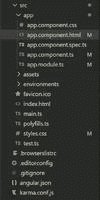
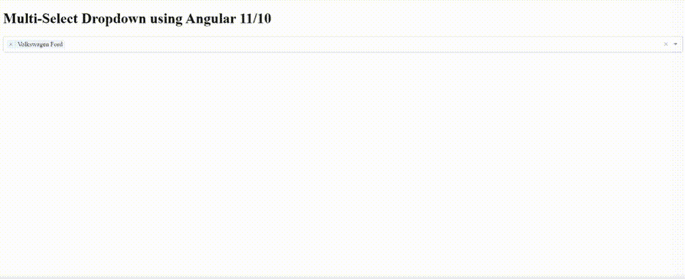

# 如何使用 Angular 11/10 进行多选下拉？

> 原文:[https://www . geesforgeks . org/如何进行多选-下拉-使用-angular-11-10/](https://www.geeksforgeeks.org/how-to-make-a-multi-select-dropdown-using-angular-11-10/)

在本文中，我们将学习在 Angular 中构建多选下拉菜单。为了完成这个任务，我们需要 Angular 10 或 Angular 11 版本。有时我们需要在下拉菜单中显示动态提取的多选数据，为此，我们将使用 npm @ng-select/ng-select 包作为多选下拉菜单。该包用于提供一种设置方法，该方法为下拉菜单&提供了一个选项，还提供了获取所选选项值的更改事件。要使用 Angular 构建多选下拉菜单，我们将按顺序执行以下步骤。

**语法:**

```ts
<ng-select
 [items]="item-name"
 bindLabel="name"
 placeholder="Select item"
 appendTo="body"
 [multiple]="true"
 [(ngModel)]="selected">
</ng-select>
```

**先决条件:**必须预装 [NPM](https://www.geeksforgeeks.org/node-js-npm-node-package-manager/) 。

**环境设置:**

*   安装角度

    ```ts
    npm install -g @angular/cli
    ```

*   创建新的角度项目

    ```ts
    ng new <project-name>
    ```

*   通过运行项目来检查安装。您应该会在 http://localhost:4200/上看到角度着陆页面

    ```ts
    ng serve -o
    ```

**项目结构:**完成上述步骤后，我们的项目结构将如下图所示:



**创建下拉多选:**

*   创建新的应用程序。我们将使用下面的命令创建一个新的应用程序。

    ```ts
    ng new geeksforgeeks-multiSelect
    ```

*   安装@ ngselect npm 包。为了使用下拉菜单，我们将按照下面的命令从 npm 安装@ ngselect 包。

    ```ts
    npm install --save @ng-select/ng-select
    ```

**示例:**在 **app.module.ts** 文件中导入**选择模块**和**表单模块**。这里，为了在应用中使用**ngsele**。我们需要导入 *app.module.ts* 文件中的 **NgSelectModule** 和 **FormsModule** 。

## app.module.ts

```ts
import { NgModule } from "@angular/core";
import { FormsModule } from "@angular/forms";
import { BrowserModule } from "@angular/platform-browser";
import { NgSelectModule } from "@ng-select/ng-select";

import { AppComponent } from "./app.component";

@NgModule({
  declarations: [AppComponent],
  imports: [BrowserModule, FormsModule, NgSelectModule],
  providers: [],
  bootstrap: [AppComponent],
})
export class AppModule {}
```

**导入 CSS 文件:**我们需要导入一个 NgSelectModule 的 CSS。我们将使用一个默认的. theme.css，它在 ng-select/themes 文件夹中。这将为我们提供多选下拉设计。我们将在 style.css 中使用这个导入 CSS 文件。

style . CSS

```ts
@import "~@ng-select/ng-select/themes/default.theme.css";
```

在 app.component.ts 文件中声明一个包含汽车列表的对象。在这里，我们将更新 *app.component.ts* 文件。该文件用于存储包含汽车列表的“汽车”数组。我们将所有汽车的详细信息存储在 javascript 对象中，并存储在这些对象中。我们提供所有不同汽车的 id 和名称。我们还选择了所选的数组，在该数组中，我们选择了默认情况下想要选择的菜单项。

## app.component.ts

```ts
import { Component } from "@angular/core";

@Component({
  selector: "my-app",
  templateUrl: "./app.component.html",
  styleUrls: ["./app.component.css"],
})
export class AppComponent {
  title = "geeksforgeeks-multiSelect";

  cars = [
    { id: 1, name: "BMW Hyundai" },
    { id: 2, name: "Kia Tata" },
    { id: 3, name: "Volkswagen Ford" },
    { id: 4, name: "Renault Audi" },
    { id: 5, name: "Mercedes Benz Skoda" },
  ];

  selected = [{ id: 3, name: "Volkswagen Ford" }];
}
```

**渲染内容:**在这里，我们将更新我们的布局或视图文件来渲染我们的内容。在这里，我们使用*app.component.html*文件来更新或查看我们的内容，如下所示:

## app.component.html

```ts
<h1>Multi-Select Dropdown using Angular 11/10</h1>

<!-- Using Items Input -->
<ng-select
  [items]="cars"
  bindLabel="name"
  placeholder="Select Category"
  appendTo="body"
  [multiple]="true"
  [(ngModel)]="selected">
</ng-select>
```

**运行应用程序:**这一步，我们准备运行应用程序。类似的输出如下所示。

```ts
ng serve
```

**输出:**

