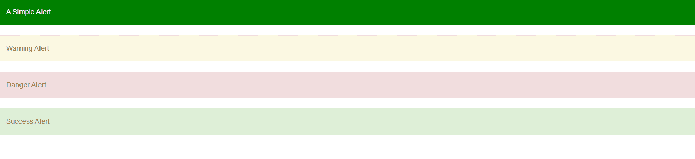

# 如何使用 Angular UI Bootstrap 进行预警？

> 原文:[https://www . geeksforgeeks . org/如何使用 angular-ui-bootstrap/](https://www.geeksforgeeks.org/how-to-make-alert-using-angular-ui-bootstrap/)

在本文中，我们将看到如何使用 Angular UI 引导程序发出警报。Angular UI Bootstrap 是 Angular UI 开发人员创建的一个 Angular JS 框架，用于提供更好的 UI，可以轻松使用。

警报指令用于根据静态和动态模型数据生成警报。

**语法:**

```ts
<div uib-alert>alert</div>
```

**从链接下载安古拉瑞:**

```ts
https://angular-ui.github.io/bootstrap
```

**进场:**

*   首先，添加项目所需的 Angular UI 引导脚本。

> <脚本 src = " https://Ajax . googleapis . com/Ajax/libs/angular js/1 . 6 . 1/angular-animate . js "></脚本>
> <脚本 src = " https://Ajax . googleapis . com/Ajax/libs/angular js/1 . 6 . 1/angular-sanitar . js "></脚本>
> T13

*   用警报的 UIBootStrap 类创建 div，这将使用户界面寻找警报。
*   现在使用这些类创建不同类型的警报并运行代码。

**示例:**

## 超文本标记语言

```ts
<!DOCTYPE html>
<html ng-app="gfg">

<head>

    <!-- Adding CDN scripts required for our page -->
    <script src=
"https://ajax.googleapis.com/ajax/libs/angularjs/1.6.1/angular.js">
    </script>
    <script src=
"https://ajax.googleapis.com/ajax/libs/angularjs/1.6.1/angular-animate.js">
    </script>
    <script src=
"https://ajax.googleapis.com/ajax/libs/angularjs/1.6.1/angular-sanitize.js">
    </script>
    <script src=
"https://angular-ui.github.io/bootstrap/ui-bootstrap-tpls-2.5.0.js">
    </script>

    <link href=
"https://netdna.bootstrapcdn.com/bootstrap/3.3.7/css/bootstrap.min.css"
        rel="stylesheet">

    <script>

        // Adding Modules
        angular.module('gfg', ['ngAnimate', 'ngSanitize', 'ui.bootstrap']);
        angular.module('gfg').controller('Alert', function ($scope) {
        });
    </script>
</head>

<body>
    <div ng-controller="Alert">

        <!-- Making a simple class using uib-alert -->
        <div uib-alert style="background-color:green;color:white">
            A Simple Alert
        </div>

        <!-- Making a Warning Alert -->
        <div uib-alert ng-class="'alert-warning'">Warning Alert</div>

        <!-- Making a Danger Alert -->
        <div uib-alert ng-class="'alert-danger'">Danger Alert</div>

        <!-- Making a Success Alert -->
        <div uib-alert ng-class="'alert-success'">Success Alert</div>
    </div>
</body>

</html>
```

**输出:**



**参考:**T2】https://angular-ui.github.io/bootstrap/#!#alert