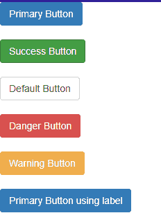

# 如何使用 Angular UI Bootstrap 制作按钮？

> 原文:[https://www . geeksforgeeks . org/如何制作按钮-使用-angular-ui-bootstrap/](https://www.geeksforgeeks.org/how-to-make-buttons-using-angular-ui-bootstrap/)

在本文中，我们将看到如何使用 Angular UI 引导程序制作按钮。Angular UI Bootstrap 是 Angular UI 开发人员创建的一个 Angular JS 框架，用于提供更好的 UI，可以轻松使用。

按钮指令用于制作按钮。

**语法:**

```ts
<buttonclass='btn btn-primary'>button</button>
```

**从链接下载安古拉瑞:**

```ts
https://angular-ui.github.io/bootstrap
```

**进场:**

*   首先，添加项目所需的 Angular UI 引导脚本。

> <脚本 src = " https://Ajax . googleapis . com/Ajax/libs/angular js/1 . 6 . 1/angular-animate . js "></脚本>
> <脚本 src = " https://Ajax . googleapis . com/Ajax/libs/angular js/1 . 6 . 1/angular-sanitar . js "></脚本>
> T13

*   用它的引导类做一个按钮，设置按钮的界面外观。
*   现在使用不同的类制作不同类型的按钮并运行代码。

**示例:**

## 超文本标记语言

```ts
<!DOCTYPE html>
<html ng-app="gfg">
  <head>

    <!-- Adding CDN scripts required for our page -->
    <script src=
"https://ajax.googleapis.com/ajax/libs/angularjs/1.6.1/angular.js">
    </script>
    <script src=
"https://ajax.googleapis.com/ajax/libs/angularjs/1.6.1/angular-animate.js">
    </script>
    <script src=
"https://ajax.googleapis.com/ajax/libs/angularjs/1.6.1/angular-sanitize.js">
    </script>
    <script src=
"https://angular-ui.github.io/bootstrap/ui-bootstrap-tpls-2.5.0.js">
    </script>

    <script>
      // Adding Modules
      angular.module('gfg', ['ngAnimate', 'ngSanitize', 'ui.bootstrap']);
      angular.module('gfg').controller('button', function ($scope) {
        });
    </script>
    <link href=
"https://netdna.bootstrapcdn.com/bootstrap/3.3.7/css/bootstrap.min.css" 
          rel="stylesheet">
  </head>
  <body>
    <div ng-controller="button">

      <!-- Making a primary button -->
      <button class="btn btn-primary">Primary Button</button>
      <br>
      <br>

      <!-- Making a succes button -->
      <button class="btn btn-success">Success Button</button>
      <br>
      <br>

      <!-- Making a default button -->
      <button class="btn btn-default">Default Button</button>
      <br>
      <br>

      <!-- Making a danger button -->
      <button class="btn btn-danger">Danger Button</button>
      <br>
      <br>

      <!-- Making a warning button -->
      <button class="btn btn-warning">Warning Button</button>

      <br>
      <br>

      <!-- Making a label primary button -->
      <label class="btn btn-primary">
        Primary Button using label
      </label>
    </div>
  </body>
</html>
```

**输出:**



**参考:**T2】https://angular-ui.github.io/bootstrap/#!#buttons