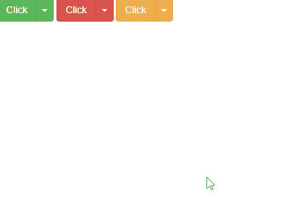

# 如何使用 Angular UI Bootstrap 制作下拉菜单？

> 原文:[https://www . geesforgeks . org/如何使用 angular-ui-bootstrap 制作下拉菜单/](https://www.geeksforgeeks.org/how-to-make-dropdown-using-angular-ui-bootstrap/)

在本文中，我们将看到如何使用 Angular UI 引导程序制作 Dropdown。Angular UI Bootstrap 是 Angular UI 开发人员创建的一个 Angular JS 框架，用于提供更好的 UI，可以轻松使用。

**语法:**

```ts
<div uib-dropdown></div>
```

**从链接下载安古拉瑞:**

```ts
https://angular-ui.github.io/bootstrap
```

**进场:**

*   首先，添加项目所需的 Angular UI 引导脚本。

> <脚本 src = " https://Ajax . googleapis . com/Ajax/libs/angular js/1 . 6 . 1/angular-animate . js "></脚本>
> <脚本 src = " https://Ajax . googleapis . com/Ajax/libs/angular js/1 . 6 . 1/angular-sanitar . js "></脚本>
> T13

*   用它的 UIBootStrap 类创建一个下拉列表，这将设置下拉列表的 UI 外观。
*   现在使用不同的类创建不同类型的下拉列表并运行代码。

**示例:**

## 超文本标记语言

```ts
<!DOCTYPE html>
<html ng-app="gfg">
  <head>

    <!-- Adding CDN scripts required for our page -->
    <script src=
"https://ajax.googleapis.com/ajax/libs/angularjs/1.6.1/angular.js">
    </script>
    <script src=
"https://ajax.googleapis.com/ajax/libs/angularjs/1.6.1/angular-animate.js">
    </script>
    <script src=
"https://ajax.googleapis.com/ajax/libs/angularjs/1.6.1/angular-sanitize.js">
    </script>
    <script src=
"https://angular-ui.github.io/bootstrap/ui-bootstrap-tpls-2.5.0.js">
    </script>

    <script>
      // Adding Modules
      angular.module('gfg', ['ngAnimate', 'ngSanitize', 'ui.bootstrap']);
      angular.module('gfg').controller('button', function ($scope) {
        });
    </script>
    <link href=
"https://netdna.bootstrapcdn.com/bootstrap/3.3.7/css/bootstrap.min.css" 
          rel="stylesheet">
  </head>
  <body>
    <div ng-controller="button">

      <!-- making a dropdown -->
      <div class="btn-group" uib-dropdown>
        <button type="button" class="btn btn-success">Click</button>
        <button type="button" class="btn btn-success" uib-dropdown-toggle>
          <span class="caret"></span>
        </button>
        <ul class="dropdown-menu" 
            uib-dropdown-menu role="menu" 
            aria-labelledby="split-button">
          <li role="menuitem">1st</li>
          <li role="menuitem">2nd</li>
          <li role="menuitem">3rd</li>
          <li role="menuitem">5th</li>
        </ul>
      </div>

      <div class="btn-group" uib-dropdown>
        <button type="button" 
                class="btn btn-danger">Click</button>
        <button type="button" 
                class="btn btn-danger" uib-dropdown-toggle>
          <span class="caret"></span>
        </button>
        <ul class="dropdown-menu" 
            uib-dropdown-menu role="menu"
            aria-labelledby="split-button">
          <li role="menuitem">1st</li>
          <li role="menuitem">2nd</li>
          <li role="menuitem">3rd</li>
          <li role="menuitem">5th</li>
        </ul>
      </div>
      <div class="btn-group" uib-dropdown>
        <button type="button" class="btn btn-warning">Click</button>
        <button type="button" 
                class="btn btn-warning" 
                uib-dropdown-toggle>
          <span class="caret"></span>
        </button>
        <ul class="dropdown-menu" 
            uib-dropdown-menu role="menu" 
            aria-labelledby="split-button">
          <li role="menuitem">1st</li>
          <li role="menuitem">2nd</li>
          <li role="menuitem">3rd</li>
          <li role="menuitem">5th</li>
        </ul>
      </div>
    </div>  
  </body>
</html>
```

**输出:**



**参考:**T2】https://angular-ui.github.io/bootstrap/#!#dropdown