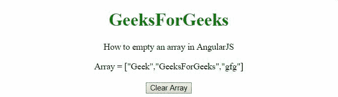

# 如何用 AngularJS 制作空数组？

> 原文:[https://www . geeksforgeeks . org/如何使用-angularjs/](https://www.geeksforgeeks.org/how-to-make-empty-an-array-using-angularjs/) 空数组

任务是在 AngularJS 中清空一个数组或删除数组中的所有元素。

**方法:**第一个示例使用 **[]符号**重新初始化数组，最终从数组中移除所有元素。第二个示例通过使用**长度属性**将数组的长度设置为 0，这也会清空数组。

**例 1:**

```tshtml
<!DOCTYPE HTML>
<html>

<head>
    <script src=
"//ajax.googleapis.com/ajax/libs/angularjs/1.2.13/angular.min.js">
    </script>

    <script>
        var myApp = angular.module("app", []);
        myApp.controller("controller", function ($scope) {
            $scope.arr = ['Geek', 'GeeksForGeeks', 'gfg'];
            $scope.emptyArr = function () {
                $scope.arr = [];

            };
        });
    </script>
</head>

<body style="text-align:center;">
    <h1 style="color:green;">
        GeeksForGeeks
    </h1>
    <p>
        How to empty an array in AngularJS
    </p>
    <div ng-app="app">
        <div ng-controller="controller">
            Array = {{arr}}<br><br>
            <button ng-click='emptyArr()'>
                Clear Array
            </button>
        </div>
    </div>
</body>

</html>
```

**输出:**



**例 2:**

```tshtml
<!DOCTYPE HTML>
<html>

<head>
    <script src=
"//ajax.googleapis.com/ajax/libs/angularjs/1.2.13/angular.min.js">
    </script>

    <script>
        var myApp = angular.module("app", []);
        myApp.controller("controller", function ($scope) {
            $scope.arr = ['Geek', 'GeeksForGeeks', 'gfg'];
            $scope.emptyArr = function () {
                $scope.arr.length = 0;

            };
        });
    </script>
</head>

<body style="text-align:center;">
    <h1 style="color:green;">
        GeeksForGeeks
    </h1>
    <p>
        How to empty an array in AngularJS
    </p>
    <div ng-app="app">
        <div ng-controller="controller">
            Array = {{arr}}<br><br>
            <button ng-click='emptyArr()'>
                Clear Array
            </button>
        </div>
    </div>
</body>

</html>
```

**输出:**

