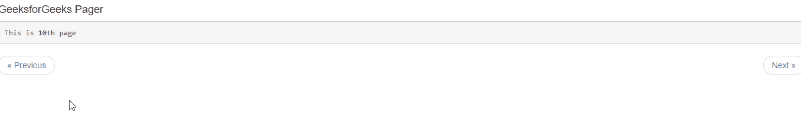

# 如何使用 Angular UI 引导制作 Pager？

> 原文:[https://www . geeksforgeeks . org/如何使用 angular-ui-bootstrap 制作寻呼机/](https://www.geeksforgeeks.org/how-to-make-pager-using-angular-ui-bootstrap/)

在本文中，我们将看到如何使用 Angular UI 引导程序制作 Dropdown。它是 AngularJS 框架，由 Angular UI 开发人员创建，用于提供更好的用户界面，可以轻松使用。

**语法:**

```
<div uib-pager></div>
```

**从链接下载安古拉瑞:**

```
https://angular-ui.github.io/bootstrap
```

**进场:**

*   首先，添加项目所需的 Angular UI 引导脚本。

> <脚本 src = " https://Ajax . googleapis . com/Ajax/libs/angular js/1 . 6 . 1/angular-animate . js "></脚本>
> <脚本 src = " https://Ajax . googleapis . com/Ajax/libs/angular js/1 . 6 . 1/angular-sanitar . js "></脚本>
> T13

*   用它的 UIBootStrap 类创建寻呼机，这些类将设置寻呼机的 UI 外观。
*   现在使用不同的类创建不同类型的寻呼机并运行代码。

**示例:**

```
<!DOCTYPE html>
<html ng-app="gfg">

<head>

    <!-- Adding CDN scripts required for our page -->
    <script src=
"https://ajax.googleapis.com/ajax/libs/angularjs/1.6.1/angular.js">
    </script>
    <script src=
"https://ajax.googleapis.com/ajax/libs/angularjs/1.6.1/angular-animate.js">
    </script>
    <script src=
"https://ajax.googleapis.com/ajax/libs/angularjs/1.6.1/angular-sanitize.js">
    </script>
    <script src=
"https://angular-ui.github.io/bootstrap/ui-bootstrap-tpls-2.5.0.js">
    </script>

    <script>

        // Adding Modules
        angular.module('gfg', ['ngAnimate', 
            'ngSanitize', 'ui.bootstrap']);

        angular.module('gfg').controller('pager', 
            function ($scope) {
                $scope.page = 10
            });
    </script>

    <link href=
"https://netdna.bootstrapcdn.com/bootstrap/3.3.7/css/bootstrap.min.css" 
        rel="stylesheet">
</head>

<body>
    <div ng-controller="pager">

        <!-- Making a pager -->
        <h4>GeeksforGeeks Pager</h4>
        <pre>This is {{page}}th page</pre>
        <ul uib-pager total-items="100" 
            ng-model="page">
        </ul>
    </div>
</body>

</html>
```

**输出:**



**参考:**T2】https://angular-ui.github.io/bootstrap/#!#pager