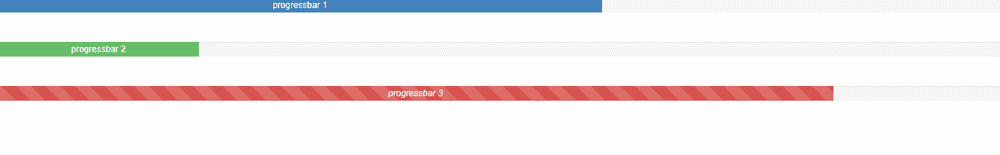

# 如何使用 Angular UI Bootstrap 制作 Progressbar？

> 原文:[https://www . geesforgeks . org/how-make-progress bar-using-angular-ui-bootstrap/](https://www.geeksforgeeks.org/how-to-make-progressbar-using-angular-ui-bootstrap/)

在本文中，我们将看到如何使用 Angular UI 引导程序制作 Dropdown。Angular UI Bootstrap 是 Angular UI 开发人员创建的一个 Angular JS 框架，用于提供更好的 UI，可以轻松使用。

**语法:**

```ts
<div uib-progressbar></div>
```

**从链接下载安古拉瑞:**

```ts
https://angular-ui.github.io/bootstrap
```

**进场:**

*   首先，添加项目所需的 Angular UI 引导脚本。

> <脚本 src = " https://Ajax . googleapis . com/Ajax/libs/angular js/1 . 6 . 1/angular-animate . js "></脚本>
> <脚本 src = " https://Ajax . googleapis . com/Ajax/libs/angular js/1 . 6 . 1/angular-sanitar . js "></脚本>
> T13

*   用它的 UIBootStrap 类创建 progressbar，这将设置 UI 来寻找 progressbar。
*   现在使用不同的类创建不同类型的 progressbar 并运行代码。

**示例:**

## 超文本标记语言

```ts
<!DOCTYPE html>
<html ng-app="gfg">
  <head>

    <!-- Adding CDN scripts required for our page -->
    <script src=
"https://ajax.googleapis.com/ajax/libs/angularjs/1.6.1/angular.js">
    </script>
    <script src=
"https://ajax.googleapis.com/ajax/libs/angularjs/1.6.1/angular-animate.js">
    </script>
    <script src=
"https://ajax.googleapis.com/ajax/libs/angularjs/1.6.1/angular-sanitize.js">
    </script>
    <script src=
"https://angular-ui.github.io/bootstrap/ui-bootstrap-tpls-2.5.0.js">
    </script>

    <script>
      // Adding Modules
      angular.module('gfg', ['ngAnimate', 'ngSanitize', 'ui.bootstrap']);
      angular.module('gfg').controller('progressbar', function ($scope) {

     });
    </script>
    <link href=
"https://netdna.bootstrapcdn.com/bootstrap/3.3.7/css/bootstrap.min.css" 
          rel="stylesheet">
  </head>
  <body>
    <div ng-controller="progressbar">

      <!-- making a progressbar -->
      <div class="column">
        <div><uib-progressbar class="progress-striped active" 
                              value="60" 
                              type='primary'>progressbar 1
          </uib-progressbar></div>
        <br>
        <div><uib-progressbar class="progress-striped active" 
                              value="20" 
                              type="success">progressbar 2
          </uib-progressbar></div>
        <br>
        <div><uib-progressbar class="progress-striped active" 
                              max="200" 
                              value="140" 
                              type="danger"><i>progressbar 3</i>
          </uib-progressbar></div>

      </div>
    </div>
  </body>
</html>
```

**输出:**



**参考:**[](https://angular-ui.github.io/bootstrap/#!#popover)**[https://angular-ui.github.io/bootstrap/#!#progressbar](https://angular-ui.github.io/bootstrap/#!#progressbar)**