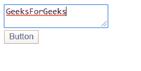
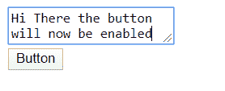
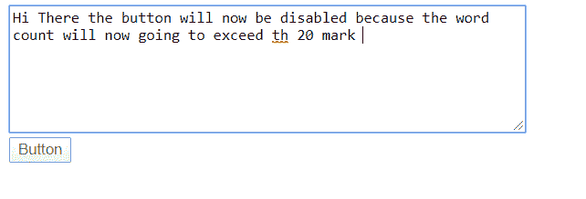

# 如何使用 angularjs 确保客户端在 textarea 中有足够的单词，以便禁用/启用按钮？

> 原文:[https://www . geeksforgeeks . org/如何通过使用-angularjs-in-order-disable-enable-a-button/](https://www.geeksforgeeks.org/how-to-make-sure-clients-have-enough-words-in-textarea-by-using-angularjs-in-order-to-disable-enable-a-button/)

这里的任务是确保用户在文本区输入足够的单词。该按钮将根据客户或用户输入的字数启用或禁用。这里的字数限制将由项目或应用程序的管理员设置。如果字数在管理员设置的参数之间，按钮将保持启用状态。如果字数超过限制或少于限制，它将保持禁用状态。

**示例:**在这种方法中，我们已经设置了 5 个单词到 20 个单词之间的字数参数。

*   这里，字数是 1，不在 5-20 字范围内，因此按钮将被禁用。

```ts
Input : GeeksforGeeks
Output: Button will be disabled
```

*   这里，字数是 5，所以现在按钮将被启用。

```ts
Input : Hello Geek! welcome to GeeksforGeeks!! 
Output: Button will be enabled
```

为了达到目标，我们将使用 [**输入**](https://www.geeksforgeeks.org/html-dom-inputevent/) 。这将有助于我们在输入每个字符后计算字数。它是一个角度事件绑定，用于响应任何 DOM 事件。这是一个异步事件，在用户与基于文本的输入控件交互时触发。

以下是按顺序提到的所有步骤:

*   **步骤 1:** 创建所需的角度 App 和组件(此处为 **txtchk** 组件)。
*   **步骤 2:** 在该组件 html 文件中(此处为**txtxhk.component.html**)编写了包含文本区域和按钮的所需 html
*   **步骤 3:**HTML 包含所需的文本区域和按钮，根据用户/客户端输入的作品数量启用/禁用。
*   **第 4 步:**(input)绑定用户输入的每个调用用户定义的 **Checklen()函数**的事件的数据，通过该函数传递每个输入**$事件**，该事件进一步用于获取输入数据。
*   **第 4 步:**按钮的禁用属性使用**检查**变量动态设置，该变量根据字数变化。
*   **步骤 5:** 在组件类型脚本文件中，定义了 **Checklen()函数**，该函数检查字数，并相应地设置按钮的启用/禁用属性。
*   **第 6 步:**有计数字数的计数器变量 **c** ，**检查**变量根据情况设置为**“真”**或**“空”**。这里我们已经设置了最小字数应该是 5 或更多，最大应该是 20。
*   **第 7 步:**传递的变量**事件**按事件给出值。
*   **第 8 步:**然后将输入值除以" "(空格)，然后计算字数并存储在 c 中。
*   **步骤 9:** 通过设置的条件检查该字数，然后将检查变量设置为“真”或“空”，这进一步将按钮的属性设置为启用/禁用。

**实现示例:**

*   **txt hk . component . html:**

## 超文本标记语言

```ts
<textarea (input)="CheckLen($event)" id="ta" ></textarea>
<br>
<button id="bt" disabled={{check}}>Button</button>
```

*   **txt hk . component . ts:**

## java 描述语言

```ts
import { Component, OnInit } from '@angular/core';

@Component({
  selector: 'app-txtchk',
  templateUrl: './txtchk.component.html',
  styleUrls: ['./txtchk.component.css']
})
export class TxtchkComponent implements OnInit {
  c=0;  //defined counter
  constructor() { }
  check;  //defined check variable
  ngOnInit(): void {
  }
//value of textarea is taken from event
  CheckLen(event){

    // c counts the number of words of input value
    this.c=event.target.value.split(' ').length;

    // We have set that minimum word count should
    // be 5 or more and the maximum should be 20.
    if(this.c<5 || this.c>20){       
      this.check=true;
    }
    if(this.c<=20 && this.c>=5){
      this.check=null;
    }
  }
}
```

**输出:**启动开发服务器，在文本区输入单词，查看按钮在特定输出上是启用还是禁用。下面是几个在控制台上记录字数的输出示例。

*   按钮被禁用，因为单词少于 5。



*   在这种情况下，按钮被启用，因为单词多于 5 且少于 21。



*   该按钮被禁用，因为单词超过 20 个。

