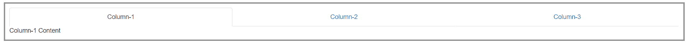
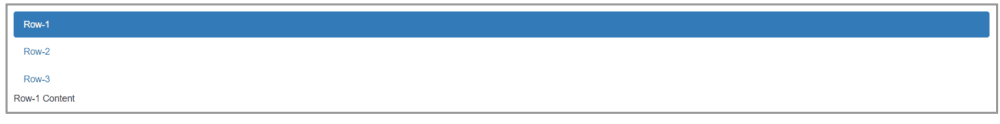

# 如何使用 Angular UI Bootstrap 制作选项卡？

> 原文:[https://www . geeksforgeeks . org/如何制作标签-使用-angular-ui-bootstrap/](https://www.geeksforgeeks.org/how-to-make-tabs-using-angular-ui-bootstrap/)

在本文中，我们将看到如何使用 Angular UI 引导程序制作选项卡。Angular UI Bootstrap 是 Angular UI 开发人员创建的一个 Angular JS 框架，用于提供更好的 UI，可以轻松使用。

**从链接下载安古拉瑞:**

```ts
https://angular-ui.github.io/bootstrap
```

**进场:**

*   首先，添加项目所需的 Angular UI 引导脚本。

> <脚本 src = " https://Ajax . googleapis . com/Ajax/libs/angular js/1 . 6 . 1/angular-animate . js "></脚本>
> <脚本 src = " https://Ajax . googleapis . com/Ajax/libs/angular js/1 . 6 . 1/angular-sanitar . js "></脚本>
> T13

*   用它的 UIBootStrap 类创建选项卡，这将设置选项卡的 UI 外观。
*   现在使用不同的类创建不同类型的选项卡并运行代码。

**示例 1:** 制作内容对齐的标签。

## 超文本标记语言

```ts
<!DOCTYPE html>
<html ng-app="gfg">
  <head>

    <!-- Adding CDN scripts required for our page -->
    <script src=
 "https://ajax.googleapis.com/ajax/libs/angularjs/1.6.1/angular.js">
    </script>
    <script src=
"https://ajax.googleapis.com/ajax/libs/angularjs/1.6.1/angular-animate.js">
    </script>
    <script src=
"https://ajax.googleapis.com/ajax/libs/angularjs/1.6.1/angular-sanitize.js">
    </script>
    <script src=
 "https://angular-ui.github.io/bootstrap/ui-bootstrap-tpls-2.5.0.js">
    </script>
    <link href=
"https://netdna.bootstrapcdn.com/bootstrap/3.3.7/css/bootstrap.min.css" 
          rel="stylesheet">
    <script>
      // Adding Modules
      angular.module('gfg', ['ngAnimate', 'ngSanitize', 'ui.bootstrap']);
      angular.module('gfg').controller('tab', function ($scope) {
      });
    </script>
  </head>

  <body>
    <div ng-controller="tab" 
         style="padding: 10px; margin: 10px; border-style: double;">
      <!-- making a tab -->
      <uib-tabset active="activeJustified" justified="true">
        <uib-tab index="0" heading="Column-1">
          Column-1 Content
        </uib-tab>
        <uib-tab index="1" heading="Column-2">
          Column-2 Content
        </uib-tab>
        <uib-tab index="2" heading="Column-3">
          Column-3 Content
        </uib-tab>
      </uib-tabset>
    </div>
  </body>
</html>
```

**输出:**



**例 2:**

## 超文本标记语言

```ts
<!DOCTYPE html>
<html ng-app="gfg">
  <head>

    <!-- Adding CDN scripts required for our page -->
    <script src=
  "https://ajax.googleapis.com/ajax/libs/angularjs/1.6.1/angular.js">
    </script>
    <script src=
 "https://ajax.googleapis.com/ajax/libs/angularjs/1.6.1/angular-animate.js">
    </script>
    <script src=
"https://ajax.googleapis.com/ajax/libs/angularjs/1.6.1/angular-sanitize.js">
    </script>
    <script src=
"https://angular-ui.github.io/bootstrap/ui-bootstrap-tpls-2.5.0.js">
    </script>
    <link href=
 "https://netdna.bootstrapcdn.com/bootstrap/3.3.7/css/bootstrap.min.css" 
          rel="stylesheet">

    <script>
      // Adding Modules
      angular.module('gfg', ['ngAnimate', 'ngSanitize', 'ui.bootstrap']);
      angular.module('gfg').controller('tab', function ($scope) {
      });
    </script>
  </head>

  <body>
    <div ng-controller="tab" 
         style="padding: 10px; margin: 10px; border-style: double;">
        <!-- making a tab -->
        <uib-tabset active="activePill" vertical="true" type="pills">
            <uib-tab index="0" heading="Row-1">
              Row-1 Content
          </uib-tab>
            <uib-tab index="1" heading="Row-2">
              Row-2 Content
          </uib-tab>
            <uib-tab index="2" heading="Row-3">
              Row-3 Content
          </uib-tab>
        </uib-tabset>
    </div>
  </body>
</html>
```

**输出:**



**参考:**[](https://angular-ui.github.io/bootstrap/#!#popover)**[https://angular-ui.github.io/bootstrap/#!#Tabs](https://angular-ui.github.io/bootstrap/#!#Tabs)**