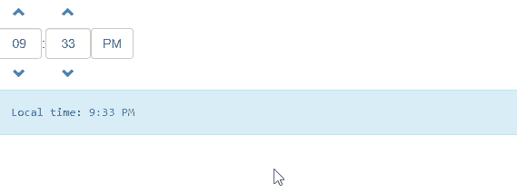

# 如何使用 Angular UI Bootstrap 制作 Timepicker？

> 原文:[https://www . geeksforgeeks . org/how-to-make-time picker-use-angular-ui-bootstrap/](https://www.geeksforgeeks.org/how-to-make-timepicker-using-angular-ui-bootstrap/)

在本文中，我们将看到如何使用 Angular UI 引导程序制作 Dropdown。

Angular UI Bootstrap 是 Angular UI 开发人员创建的一个 Angular JS 框架，目的是提供更好的 UI，可以轻松使用。

**语法:**

```ts
<div uib-timepicker></div>
```

**从链接下载安古拉瑞:**

```ts
https://angular-ui.github.io/bootstrap
```

**进场:**

*   首先，添加项目所需的 Angular UI 引导脚本。

> <脚本 src = " https://Ajax . googleapis . com/Ajax/libs/angular js/1 . 6 . 1/angular-animate . js "></脚本>
> <脚本 src = " https://Ajax . googleapis . com/Ajax/libs/angular js/1 . 6 . 1/angular-sanitar . js "></脚本>
> T13

*   用它的 UIBootStrap 类创建时间选择器，这将设置时间选择器的 UI 外观。
*   现在使用不同的类创建不同类型的 timepicker 并运行代码。

**示例:**

## 超文本标记语言

```ts
<!DOCTYPE html>
<html ng-app="gfg">
  <head>

  <script src=
"https://ajax.googleapis.com/ajax/libs/angularjs/1.6.1/angular.js">
    </script>
    <script src=
"https://ajax.googleapis.com/ajax/libs/angularjs/1.6.1/angular-animate.js">
    </script>
    <script src=
"https://ajax.googleapis.com/ajax/libs/angularjs/1.6.1/angular-sanitize.js">
    </script>
    <script src=
"https://angular-ui.github.io/bootstrap/ui-bootstrap-tpls-2.5.0.js">
    </script>
    <script>
      // Adding Modules
      angular.module('gfg', ['ngAnimate', 'ngSanitize', 'ui.bootstrap']);
      angular.module('gfg').controller('timepicker', function ($scope) {
        $scope.ismeridian = true;
        $scope.lcltime = new Date();
        $scope.hrs = 1;
        $scope.mnt = 1;

      });
    </script>

    <link href=
 "https://netdna.bootstrapcdn.com/bootstrap/3.3.7/css/bootstrap.min.css" 
          rel="stylesheet">

  </head>
  <body>
    <div ng-controller="timepicker">

      <!-- making a timepicker -->
      <div class="column">

         <div uib-timepicker ng-model="lcltime"
              ng-change="changed()" hour-step="hrs" 
              minute-step="mnt" show-meridian="ismeridian">
         </div>

           <pre class="alert alert-info">
           Local time: {{lcltime | date:'shortTime' }}
           </pre>
        </div>
      </div>
  </body>
</html>
```

**输出:**



**参考:**[](https://angular-ui.github.io/bootstrap/#!#popover)**[【https://angular-ui . github . io/bootstrap/#！# time picker〔T7〕](https://angular-ui.github.io/bootstrap/#!#Timepicker)**