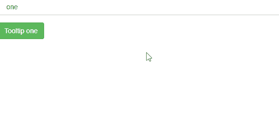

# 如何使用角度 UI 引导制作工具提示？

> 原文:[https://www . geesforgeks . org/如何制作-工具提示-使用-angular-ui-bootstrap/](https://www.geeksforgeeks.org/how-to-make-tooltip-using-angular-ui-bootstrap/)

在本文中，我们将看到如何使用 Angular UI 引导程序制作下拉菜单。

Angular UI Bootstrap 是 Angular UI 开发人员创建的一个 Angular JS 框架，用于提供更好的 UI，可以轻松使用。

**语法:**

```ts
<div uib-tooltip></div>
```

**从链接下载安古拉瑞:**

```ts
https://angular-ui.github.io/bootstrap
```

**进场:**

*   首先，添加项目所需的 Angular UI 引导脚本。

> <脚本 src = " https://Ajax . googleapis . com/Ajax/libs/angular js/1 . 6 . 1/angular-animate . js "></脚本>
> <脚本 src = " https://Ajax . googleapis . com/Ajax/libs/angular js/1 . 6 . 1/angular-sanitar . js "></脚本>
> T13

*   用它的引导类制作工具提示，引导类将设置工具提示的用户界面外观。
*   现在使用不同的类制作不同类型的工具提示并运行代码。

**示例:**

## 超文本标记语言

```ts
<!DOCTYPE html>
<html ng-app="gfg">
  <head>

    <!-- Adding CDN scripts required for our page -->
    <script src=
"https://ajax.googleapis.com/ajax/libs/angularjs/1.6.1/angular.js">
    </script>
    <script src=
"https://ajax.googleapis.com/ajax/libs/angularjs/1.6.1/angular-animate.js">
    </script>
    <script src=
"https://ajax.googleapis.com/ajax/libs/angularjs/1.6.1/angular-sanitize.js">
    </script>
    <script src=
"https://angular-ui.github.io/bootstrap/ui-bootstrap-tpls-2.5.0.js">
    </script>
    <script>
      // Adding Modules
      angular.module('gfg', ['ngAnimate', 'ngSanitize', 'ui.bootstrap']);
      angular.module('gfg').controller('tooltip', function ($scope) {
        $scope.gfg = {
          options: [
            'one',
            'two',
            'three',
            'four',
            'five',
            'six',
            'seven',
            'eight',
            'nine',
            'ten',
            'eleven',
            'twelve'
          ],
          selected: 'one'
        };
      });
    </script>

    <link href=
"https://netdna.bootstrapcdn.com/bootstrap/3.3.7/css/bootstrap.min.css" 
          rel="stylesheet">

  </head>
  <body>
    <div ng-controller="tooltip">

      <!-- making a tooltip -->
      <div class="column">

        <div class="form-group">

          <select class="form-control" 
                  ng-model="gfg.selected" 
                  ng-options="o as o for o in gfg.options">
          </select>
        </div>

        <button tooltip-placement="{{gfg.selected}}" 
                type="button" class="btn btn-success">
          Tooltip {{gfg.selected}}
        </button>

      </div>
    </div>
  </body>
</html>
```

**输出:**



**参考:**[](https://angular-ui.github.io/bootstrap/#!#popover)**[【https://angular-ui . github . io/bootstrap/#！# tooltip〔T7〕](https://angular-ui.github.io/bootstrap/#!#tooltip)**