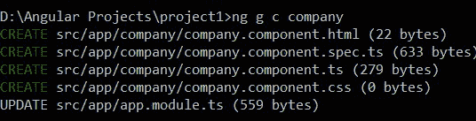
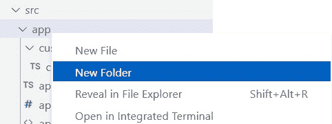
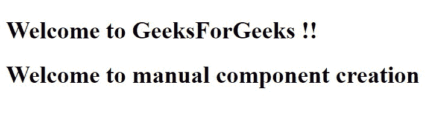

# 如何在 AngularJS 中手动注册一个组件？

> 原文:[https://www . geeksforgeeks . org/如何手动注册 in-angularjs 组件/](https://www.geeksforgeeks.org/how-to-manually-register-a-component-in-angularjs/)

众所周知，angularJS 中的组件是每个应用程序的基本构件。通常，我们可以通过简单地运行以下命令来创建一个角度分量。

```ts
ng g c component_name
```

这将创建一系列文件，如下图所示。这包括以下文件–

1.  **HTML 文件:**用于生成 HTML DOM(文档对象模型)。
2.  **规范文件:**用于运行组件的单元测试用例。
3.  **component.ts:** 这是包含项目主要逻辑的主文件。
4.  **css 文件:**用于给网页添加样式。



角度命令行界面组件创建

在 Angular CLI 生成组件的最后一部分，它只是更新 app.module.ts 文件以包含新生成的组件。如果仔细观察，这个步骤与我们在下面显示的步骤 3 中执行的步骤完全相同。

**手动生成组件的步骤–**

*   在角度项目的**【app】**文件夹下新建一个文件夹。为此，请在您觉得合适的任何 IDE 中打开您的项目。我们将在这里使用 VS 代码集成开发环境。现在右键单击“app”，然后单击新文件夹，或者单击上面的图标来创建文件夹，或者从文件资源管理器手动创建文件夹。



创建新文件夹

*   现在创建一个 typescript 文件。就当是*T1【客户组件】ts 吧。*现在我们给这个文件添加内容，比如模板、选择器、样式等。

## customer.component.ts

```ts
// This is our main component class called
// as 'CustomerComponent'

// Here we have imported 'Component' 
// module from Angular library
import { Component } from "@angular/core";

@Component({

    // This selector is used to refer
    // to the component in html
    selector: 'chinmay',

    /* Template or templateURL is used to 
    provide the HTML part which is to be 
    rendered into the browser 
    DOM(Document Object Model) */
    template: '<h1> Welcome to manual component creation</h1>',

    // CSS styles if any required can 
    // be specified here.
    styles: []        
    }
)
// Exporting the component class so 
// that it can be used to generate 
// relationships among the components
export class CustomerComponent {
}
```

*   现在转到 ***app.module.ts*** 文件，将您自定义创建的组件导入到 **@NgModule** 声明部分。

## app.module.ts

```ts
/* For the first few lines, we will have 
to import certain Angular library modules 
So that we can run our project smoothly.*/

import { BrowserModule } from '@angular/platform-browser';
import { NgModule } from '@angular/core';

import { AppRoutingModule } from './app-routing.module';
import { AppComponent } from './app.component';

// Here we have imported our custom created component
import { CustomerComponent } from './customer/customer';

@NgModule({
    declarations: [
        AppComponent,
        CustomerComponent
    ],
    imports: [
        BrowserModule,
        AppRoutingModule
    ],
    providers: [],
    bootstrap: [AppComponent]
})
export class AppModule { }
```

*   最后也是最后一步，转到**app.component.html**文件，添加您在自定义组件**排版脚本文件(custom.ts)** 中添加的选择器。

## app.component.html

```ts
<h1>Welcome to GeeksForGeeks !! </h1>
<!-- Placeholder HTML DOM -->
<!-- CustomerComponent selector HTML DOM -->
<chinmay></chinmay>
```

*   搞定了。！现在，您已经成功地在 Angular 中创建和手动注册了一个组件。此外，您还可以创建支持组件所需的支持文件，如 CSS 样式、HTML 和组件单元测试的规范文件。



浏览器上的项目输出