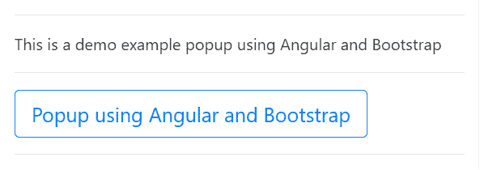
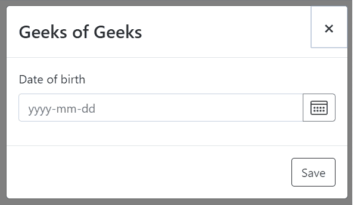

# 如何使用 Angular 和 Bootstrap 打开弹出窗口？

> 原文:[https://www . geeksforgeeks . org/如何使用角度和引导打开弹出窗口/](https://www.geeksforgeeks.org/how-to-open-popup-using-angular-and-bootstrap/)

向您的 Angular 应用程序添加 Bootstrap 是一个简单的过程。只需在您的 Angular CLI 中编写以下命令。它会将引导添加到您的 node_modules 文件夹中。

```ts
ng add @ng-bootstrap/ng-bootstrap

```

**方法:**在对应组件的 TypeScript 文件中导入 NgbModal 模块，然后我们要在对应组件的 HTML 文件中使用上面的模块为弹出模型编写代码。

**语法:**

*   **在打字稿文件中:**

    ```ts
    import {NgbModal} from '@ng-bootstrap/ng-bootstrap';

    ```

*   **在 html 文件中:**

    ```ts
    <ng-template #content let-modal>
      ...
    </ng-template>

    ```

**示例:**模态-基本. ts

```ts
import {Component} from '@angular/core';

import {NgbModal, ModalDismissReasons} 
      from '@ng-bootstrap/ng-bootstrap';

@Component({
  selector: 'ngbd-modal-basic',
  templateUrl: './modal-basic.html'
})
export class NgbdModalBasic {
  closeResult = '';

  constructor(private modalService: NgbModal) {}

  open(content) {
    this.modalService.open(content,
   {ariaLabelledBy: 'modal-basic-title'}).result.then((result) 
      => {
      this.closeResult = `Closed with: ${result}`;
    }, (reason) => {
      this.closeResult = 
         `Dismissed ${this.getDismissReason(reason)}`;
    });
  }

  private getDismissReason(reason: any): string {
    if (reason === ModalDismissReasons.ESC) {
      return 'by pressing ESC';
    } else if (reason === ModalDismissReasons.BACKDROP_CLICK) {
      return 'by clicking on a backdrop';
    } else {
      return `with: ${reason}`;
    }
  }
}
```

现在，我们必须使用 ng-template 来构建将创建弹出窗口的模型。

**例:**T2】modal-basic.html

```ts
<ng-template #content let-modal>
    <div class="modal-header">
        <h4 class="modal-title" 
            id="modal-basic-title">
            Geeks of Geeks
        </h4>
        <button type="button" class="close"
                aria-label="Close" (click)=
                "modal.dismiss('Cross click')">

            <span aria-hidden="true">
                ×
            </span>
        </button>
    </div>
    <div class="modal-body">
        <form>
            <div class="form-group">
                <label for="dateOfBirth">
                    Date of birth
                </label>
                <div class="input-group">
                    <input id="dateOfBirth" 
                        class="form-control" 
                        placeholder="yyyy-mm-dd" 
                        name="dp" ngbDatepicker
                        #dp="ngbDatepicker">

                    <div class="input-group-append">
                        <button class="btn 
                            btn-outline-secondary calendar"
                            (click)="dp.toggle()"
                            type="button">
                        </button>
                    </div>
                </div>
            </div>
        </form>
    </div>
    <div class="modal-footer">
        <button type="button" 
            class="btn btn-outline-dark" 
            (click)="modal.close('Save click')">
            Save
        </button>
    </div>
</ng-template>

<button class="btn btn-lg btn-outline-primary" 
    (click)="open(content)">
    Popup using Angular and Bootstrap
</button>
```

**输出:**

