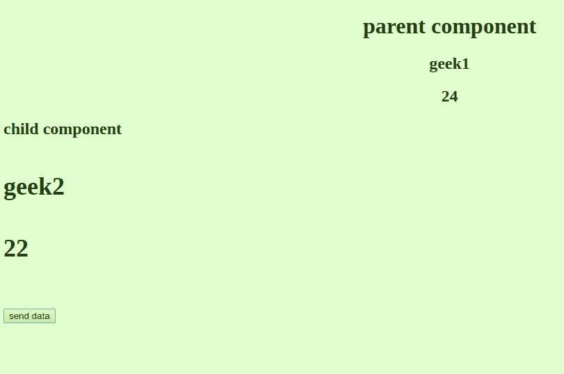
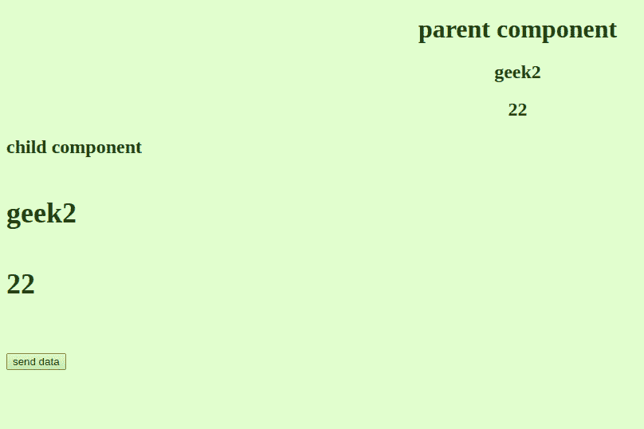

# 如何在 Angular 9 中将两个参数传递给 EventEmitter？

> 原文:[https://www . geesforgeks . org/how-to-event emitter-in-angular-9/](https://www.geeksforgeeks.org/how-to-pass-two-parameters-to-eventemitter-in-angular-9/)

在 Angular 中，我们可以在两个方向上传输数据，即内部:传输到子组件，外部:传输到父组件。对于发送数据给子组件，我们使用属性绑定，对于后者，我们使用**事件发射器。**

在本文中，我们将讨论 EventEmitter 指令，以及如何在其中传递 2 个参数。

让我们看看事件发射器的源代码:

```ts
export declare class EventEmitter<T> 
                  extends Subject<T> {
    __isAsync: boolean;
    constructor(isAsync?: boolean);
    emit(value?: T): void;
    subscribe(
        generatorOrNext?: any, error?:
            any, complete?: any): any;
}
```

很明显，在 **emit** 方法中，只能传递一个 T 类型的参数，所以我们不能将两个参数直接传递给它。相反，我们可以创建一个包含所有参数的对象，并将该对象作为单个实体传递。

**进场:**

*   EventEmitter 允许我们发射任何类型的对象，因此我们将利用它。
*   为了传递参数，我们将把所有参数包装在花括号内(这将把它们组合成一个对象)，并把它传递给 emit 方法。
*   为了接收父组件中的参数，我们将创建一个类似类型的对象，并用接收到的对象的值更新它的值。

**语法:**

```ts
@Output() sendobject = new EventEmitter<any>();

this.sendobject.emit({stringval, numval, ...});

```

**示例:**我们将在子组件中创建两个属性，并使用事件发射器在父组件中接收它们。

**子组件代码:**

```ts
import { 
       Component, OnInit, EventEmitter, Input, Output
      } from '@angular/core';

@Component({
  selector: 'app-test',

  template: `
    <h2>child component<h2>
    <h4>{{name}}</h4>
    <h4>{{age}}</h4>
    <button (click) = "send_name_age()">send data</button>
  `,
  styles: []
})
export class TestComponent {

  constructor() { }

  public name = "geek2";
  public age = 22;

  /* we will define the type of the
     an object that will be emitted.*/

  @Output() public data = 
        new EventEmitter<{name:string, age:number}>();

  send_name_age()
  {

  /* we will wrap the parameters 
     to be sent inside the curly brackets.*/

    this.data.emit({name:this.name, age:this.age});
  }

  ngOnInit(): void {
  }

}
```

**父组件代码:**

```ts
import { Component } from '@angular/core';

@Component({
    selector: 'app-root',
    template: `

    <div style="text-align: center;" >
        <h1>parent component</h1>
        <h2>{{model.name}}</h2>
        <h2>{{model.age}}</h2>
    </div>

    /* The data that is sent by the
       child component will be 
       received in the */

    /* Parent component as a parameter 
       for change_name_age method. */

  <app-test (data) = "change_name_age($event)" >
  </app-test>

  `,
    styleUrls: []
})
export class AppComponent {

    /* Create a model of the type that is 
       emitted by the child component to 
       receive it.*/

    public model = { name: "geek1", age: 24 }

    change_name_age(data) {

        /* Update the current model with
           the value sent by the child 
           component. */
        this.model = data;
    }
}
```

**输出:**

已成功从父组件的子组件接收年龄和姓名。

*   领取姓名和年龄前:
    
*   父组件中的名称和年龄在从子组件接收后更新。