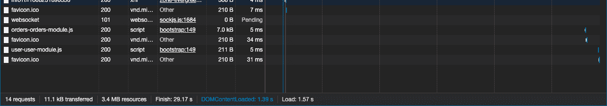
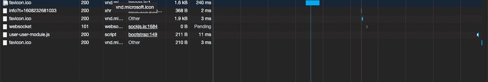

# 如何选择预加载哪个角度束？

> 原文:[https://www . geeksforgeeks . org/如何挑选要预加载的角度束/](https://www.geeksforgeeks.org/how-to-pick-which-angular-bundle-to-preload/)

angular 中的加载策略决定了应用程序在浏览器中运行时如何加载应用程序模块。在 Angular 中，我们有三种类型的加载:急切加载、惰性加载和预加载。默认情况下，Angular 遵循快速加载，即一旦应用程序开始在浏览器中下载，模块就开始在浏览器中加载。您还可以将一些模块设置为延迟加载，即模块在被显式调用之前不会开始加载。
除了这两种加载策略，我们还有第三种加载方式，即预加载策略。在确定预加载哪个模块之前，让我们先了解一下什么是角度预加载。

**在预加载**中，我们明确告诉 Angular 编译器我们要先预渲染哪些懒加载的模块，即在预加载中，我们定义一些模块在主模块完成加载后马上进行预加载，避免了懒加载模块渲染的延迟，以获得更好的用户体验。

我们根据各种场景来决定应该预加载哪些模块。

*   如果模块大小太大，我们一般会决定加载这样的模块来预加载，因为当用户调用这样的模块时，它们要么是完全加载，要么是完全部分加载，这样用户就不用等待了。
*   应用程序中经常使用的模块也被设置为预加载，以避免延迟时间。

因此，这些是一些重要的条件，在这些条件下，您可以决定哪些延迟加载的模块应该作为预加载来加载。

现在，让我们了解如何在 angular 应用程序中实现预加载。

有两种方法可以做到这一点:第一，我们可以预加载所有的惰性加载模块；第二，我们可以定义特定的惰性模块来预加载。

*   **作为预加载加载的所有惰性模块(预加载策略:预加载所有模块):**

**逼近. ts:**

## java 描述语言

```ts
import { NgModule } from '@angular/core';
import { Routes, RouterModule, PreloadAllModules } 
            from '@angular/router';

const routes: Routes = [
    {
        path: 'user',
        loadChildren: () => import('./user/user.module')
            .then(m => m.UserModule)
    },
    {
        path: 'orders',
        loadChildren: () => import('./orders/orders.module')
            .then(m => m.OrdersModule)
    },
    {
        path: '',
        redirectTo: '',
        pathMatch: 'full'
    }
];

@NgModule({
    imports: [
        RouterModule.forRoot(routes, 
            { prelaodingStrategy: PreloadAllModules })
    ],
    exports: [RouterModule],
    providers: []
})
export class AppRoutingModule { }

export class AppRoutingModule { }
```

**UserComponent.ts:**

## java 描述语言

```ts
import { Component, OnInit } from '@angular/core';

@Component({
  selector: 'app-user',
  templateUrl: './user.component.html',
  styleUrls: ['./user.component.css']
})
export class UserComponent implements OnInit, OnDestroy {

  constructor() { }

  ngOnInit() {
  Console.log("Loading started......");
  }

  ngOnDestroy() {
  }

}
```

**订单组件。ts:**

## java 描述语言

```ts
import { Component, OnInit } from '@angular/core';

@Component({
  selector: 'app-order',
  templateUrl: './order.component.html',
  styleUrls: ['./order.component.css']
})
export class OrderComponent implements OnInit {

  constructor() { }

  ngOnInit() {
  Console.log("Order Loading started......");
  }

}
```

**输出:**当您转到开发人员选项下的网络选项卡时，您会看到一旦您的引导组件被加载，所有其他模块(用户和订单)也开始加载，这是所有模块的预加载。



如您所见，订单和用户模块都开始加载

**作为预加载加载的特定惰性模块(数据:{preload: true}):**

**逼近. ts:**

## java 描述语言

```ts
import { NgModule } from '@angular/core';
import { Routes, RouterModule, PreloadAllModules } 
        from '@angular/router';

const routes: Routes = [
    {
        path: 'user',
        loadChildren: () => import('./user/user.module')
            .then(m => m.UserModule),
        data: { preload: true }
    },
    {
        path: 'orders',
        loadChildren: () => import('./orders/orders.module')
            .then(m => m.OrdersModule)
    },
    {
        path: '',
        redirectTo: '',
        pathMatch: 'full'
    }
];

@NgModule({
    imports: [
        RouterModule.forRoot(routes)
    ],
    exports: [RouterModule],
    providers: []
})
export class AppRoutingModule { }
```

**UserComponent.ts:**

## java 描述语言

```ts
import { Component, OnInit } from '@angular/core';

@Component({
  selector: 'app-user',
  templateUrl: './user.component.html',
  styleUrls: ['./user.component.css']
})
export class UserComponent implements OnInit, OnDestroy {

  constructor() { }

  ngOnInit() {
  Console.log("Loading started......");
  }

  ngOnDestroy() {
  }

}
```

**订单组件。ts:**

## java 描述语言

```ts
import { Component, OnInit } from '@angular/core';

@Component({
  selector: 'app-order',
  templateUrl: './order.component.html',
  styleUrls: ['./order.component.css']
})
export class OrderComponent implements OnInit {

  constructor() { }

  ngOnInit() {
  Console.log("order Loading started......");
  }
}
```

**输出:**在上面的例子中，我们已经为所有其他惰性加载组件中的唯一用户组件设置了 preload true。现在，如果您转到“开发人员选项”下的“网络”选项卡或下面的屏幕截图中，您将看到在加载引导组件后，只有用户组件开始加载，但订单组件直到我们明确转到该组件后才开始加载。这是定制组件的预加载。



正如您所看到的，只有用户模块开始加载，订单模块没有。

因此，通过这种方式，我们可以加载部分或全部惰性模块作为预加载。