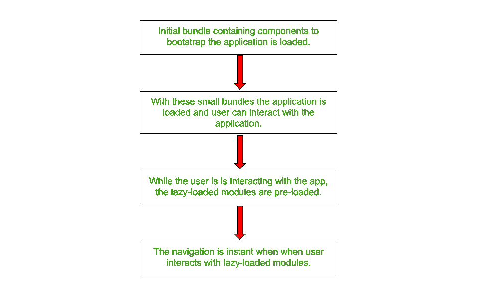
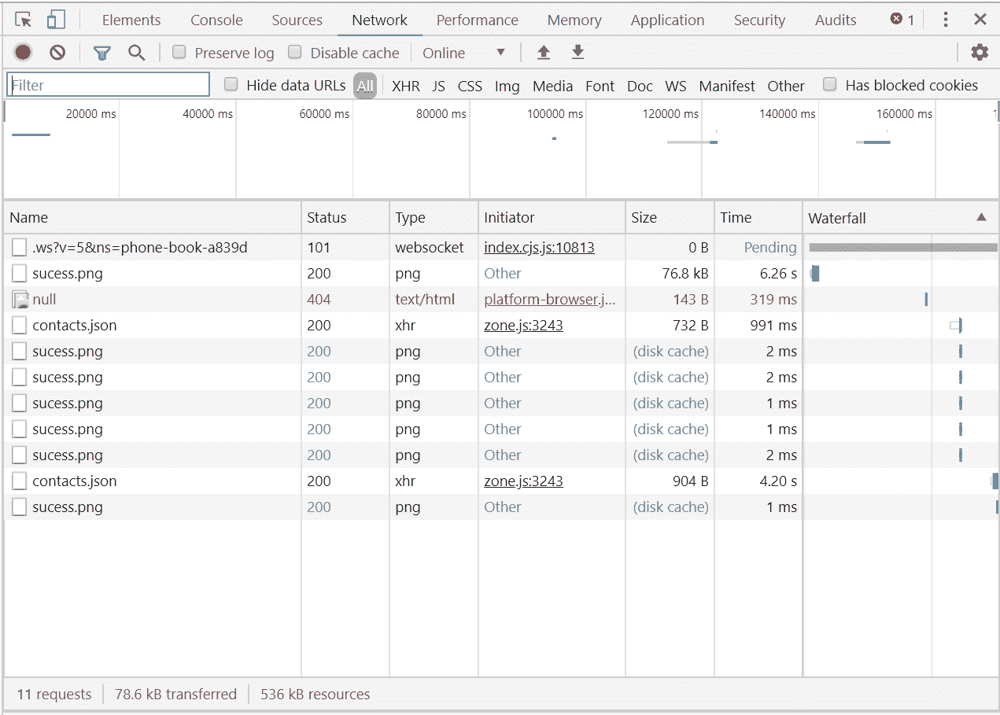

# 如何预加载所有角束？

> 原文:[https://www . geesforgeks . org/如何预加载全角度束/](https://www.geeksforgeeks.org/how-to-preload-all-angular-bundles/)

**预加载介绍:**Angular 中引入了惰性加载特性，大大提升了应用的性能。延迟加载有助于保持初始包的尺寸更小，这反过来有助于减少加载时间。但是，延迟加载的主要问题是，当用户导航(或到达)应用程序的延迟加载部分时，路由器必须从服务器获取所需的模块，这可能需要时间。

因此，即使应用程序的初始加载时间最终减少，用户也必须等待一段时间，直到路由器获取该特定模块。为了解决这个问题，Angular 提出了预加载的概念。有了这个特性，惰性可加载模块被预加载，因此用户不必等待它被获取。这种预加载发生在用户与已经在惰性加载期间加载的应用程序交互时。



**方法:**基本方法是设置我们需要的预加载策略。我们需要通过在 *app-routing.module.ts* 中明确提及来指定我们将预加载所有模块

> 抽象类 PreloadingStrategy {
> 抽象预加载(route: Route，fn:)=>可观测<any>):可观测 <any>}</any></any>

**步骤:**要预加载所有模块，只需遵循以下步骤:

*   从**app-routing . module . ts**
    **添加预加载所有模块的导入语句语法:**

    > 从“@棱角分明/核心”导入{ ng module }；
    > 从" @angular/router "导入{路由模块、路由、预加载所有模块}；

*   在 **app-routing.module.ts** 中设置路由器模块时，将包括预加载策略在内的路由器选项传递给 forRoot()功能。
    这将告诉路由器设置预加载策略来预加载所有模块。
    **语法:**

    > @NgModule({
    > 导入:【RouterModule.forRoot(appRoutes，{ preloading strategy:preloadall modules })】、
    > 导出:【路由器模块】
    > 
    > })

*   现在在 Angular CLI 中运行一个服务器来重建您的应用程序。打开*<u>http://localhost:4200</u>*。右键检查元素(或 Ctrl+Shift+I)，转到网络选项卡查看结果。
    **语法:**

    ```ts
    ng serve
    ```

**示例:**下面是一个应用程序路由模块的示例。

```ts
import { NgModule } from '@angular/core';
import { RouterModule, Routes, 
    PreloadAllModules } from '@angular/router';

import { ListComponent } from 
        './list/list.component';
import { DetailComponent } from 
        './detail/detail.component';
import { AppComponent } from './app.component';
import { PageComponent } from './page/page.component';
import { NewComponent } from './new/new.component';

const appRoutes: Routes = [
    { path: '', redirectTo: '/contact',
            pathMatch: 'full' },

    { path: 'contact', component: ListComponent },
    { path: 'details/:id', component: DetailComponent },
    { path: 'new', component: NewComponent },
    { path: 'not-found', component: PageComponent },
    { path: '**', redirectTo: '/not-found' }
]

@NgModule({
    imports: [RouterModule.forRoot(appRoutes,
        {
            preloadingStrategy: PreloadAllModules
        })],
    exports: [RouterModule]

})
export class AppRoutingModule {

}
```

**输出:**
