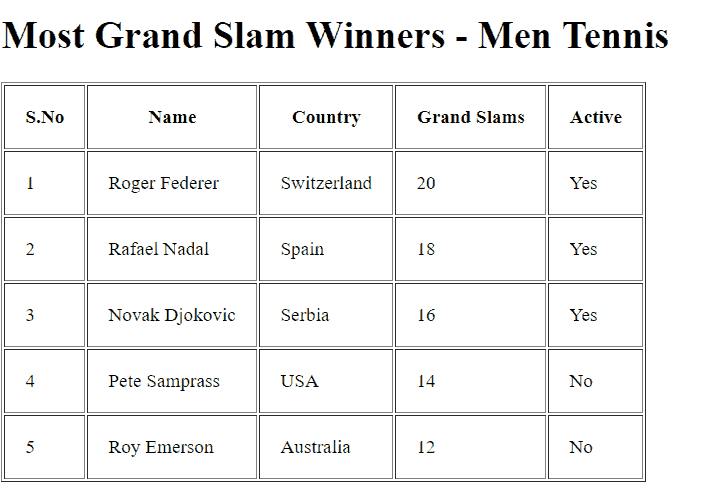
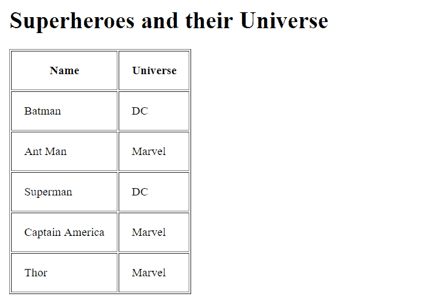

# 如何用 angularJS 打印表格格式的数组？

> 原文:[https://www . geeksforgeeks . org/如何使用-angularjs/](https://www.geeksforgeeks.org/how-to-print-an-array-in-table-format-using-angularjs/) 打印表格格式的数组

在 JavaScript 中，数据可以以数组的形式存储。每个数组项都有唯一的索引，从 0 开始。但是，如果开发人员想要在网页上显示数组中的所有项目，该怎么办。一种可能的方法是运行一个循环，从 *0* 开始直到*(array . length()–1)*的值。然而，在处理 JSON 数据时，这是不可行的，因为在已经存在的数组中可能存在另一个数组。

**AngularJS 已经提供了这方面的最佳解决方案。**
可以使用 AngularJS 的**【ng-repeat】**指令以表格格式打印数组。
**“ng-repeat”**有助于循环浏览集合元素中的项目。该指令在处理对象集合时非常有用。

**例 1:**

```
<!DOCTYPE html>
<html>
<script src=
"https://ajax.googleapis.com/ajax/libs/angularjs/1.6.9/angular.min.js">
  </script>
<style>
    body {
        margin: 2%;
        font-size: 120%;
    }

    th,
    td {
        padding: 20px;
    }
</style>

<body ng-app="myApp" ng-controller="ListController">
    <h1>Most Grand Slam Winners - Men Tennis</h1>
    <table border=1>
        <thead>
            <tr>
                <th>S.No</th>
                <th>Name</th>
                <th>Country</th>
                <th>Grand Slams</th>
                <th>Active</th>
            </tr>
        </thead>
        <tr ng-repeat="item in itemsDetails">
            <td> {{item.sno}} </td>
            <td> {{item.name}} </td>
            <td> {{item.country}} </td>
            <td> {{item.grandslams}} </td>
            <td> {{item.active}} </td>
        </tr>
    </table>

</body>
<script>
    var app = angular.module('myApp', []);
    app.controller(
      'ListController', function($scope) {

        $scope.itemsDetails = [{
                sno: 1,
                name: 'Roger Federer',
                country: 'Switzerland',
                grandslams: 20,
                active: "Yes",
            }, {
                sno: 2,
                name: 'Rafael Nadal',
                country: 'Spain',
                grandslams: 18,
                active: "Yes",
            }, {
                sno: 3,
                name: 'Novak Djokovic',
                country: 'Serbia',
                grandslams: 16,
                active: "Yes",
            }, {
                sno: 4,
                name: 'Pete Samprass',
                country: 'USA',
                grandslams: 14,
                active: "No",
            }, {
                sno: 5,
                name: 'Roy Emerson',
                country: 'Australia',
                grandslams: 12,
                active: "No",
            }

        ];

    });
</script>

</html>
```

**输出**


**代码说明:**
本申请的**【ng-app】**和**【ng-controller】**已分别命名为**【myApp】****【ListController】**。
在<脚本>中，创建了一个名为**‘items details’**的数组，并将其存储在范围变量中。这个列表包含了“男子网球五大大满贯得主”的名单。

主要目标是以表格格式打印该数组数据。
第一步是使用**【表】******【tr】****【TD】**标签创建一个表。设置了表格标题。AngularJS 的 **ng-repeat** 服务从数组中提取多个记录。**

****ng-repeat 的基本语法是:****

```
<div ng-repeat="x in list">
      {{x}}
</div>
```

**在本例中，语法被修改为**ng-repeat = " items details**中的项目。因此，**【项目详情】**的每一项将被识别为*项。JavaScript 点符号将用于访问数组内部的信息。例如，要访问存储在*“名称”*中的信息，将使用点符号*“项目详细信息.名称”*。下一步是在双括号 *{{}}* 内写那个点符号，例如； **{{itemsDetails.name}}** 。然后 AngularJS 解析这个表达式并返回想要的结果。***

*****“ng-repeat”**将循环运行该过程，直到所有数组项被选中并以表格形式返回。***

*****例 2:*****

```
*<!DOCTYPE html>
<html>
<script src=
"https://ajax.googleapis.com/ajax/libs/angularjs/1.6.9/angular.min.js">
  </script>

<style>
    body {
        margin: 2%;
        font-size: 120%;
    }

    th,
    td {
        padding: 20px;
    }
</style>

<body ng-app="myApp" ng-controller="ListController">
    <h1>Superheroes and their Universe</h1>
    <table border=1>
        <thead>
            <tr>
                <th>Name</th>
                <th>Universe</th>
            </tr>
        </thead>
        <tr ng-repeat="item in itemsDetails">
            <td> {{item.name}} </td>
            <td> {{item.universe}} </td>
        </tr>
    </table>

</body>
<script>
    var app = angular.module('myApp', []);
    app.controller('ListController', function($scope) {

        $scope.itemsDetails = [{
                name: 'Batman',
                universe: 'DC',
            }, {
                name: 'Ant Man',
                universe: 'Marvel',
            }, {
                name: 'Superman',
                universe: 'DC',
            }, {
                name: 'Captain America',
                universe: 'Marvel',
            }, {
                name: 'Thor',
                universe: 'Marvel',
            }

        ];

    });
</script>

</html>*
```

*****输出:**
***

*****代码说明:**
这个例子和前面的例子非常相似。在本例中，我们创建了一个数组，并将其命名为**“items details”**。我们将把这个数组存储在 scope 对象中。**“ng-repeat”**服务将遍历数组，一次从数组中获取一个项目，然后以表格形式显示在网页上。***