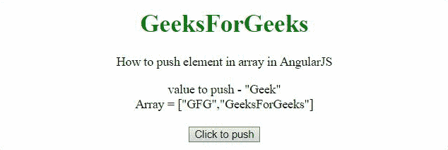
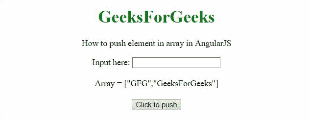

# 如何用 AngularJS 推送数组中的元素？

> 原文:[https://www . geeksforgeeks . org/如何使用-angularjs/](https://www.geeksforgeeks.org/how-to-push-elements-in-an-array-using-angularjs/) 推送数组中的元素

给定一个数组，任务是使用 AngularJS 对数组执行推送操作。

**方法:**在该方法中， **push()方法**用于将元素插入到数组的末尾。在第一个示例中，数组中插入了一个静态值“极客”，在第二个示例中，向用户提供了一个输入框来推送他们想要的值。

**例 1:**

```tshtml
<!DOCTYPE HTML>
<html>

<head>
    <script src=
"//ajax.googleapis.com/ajax/libs/angularjs/1.2.13/angular.min.js">
    </script>

<script>
        var myApp = angular.module("app", []);
        myApp.controller("controller", function ($scope) {
            $scope.arr = ['GFG', 'GeeksForGeeks'];
            $scope.val = "Geek";
            $scope.push = function () {
                $scope.arr.push($scope.val);
            };
        });
    </script>
</head>

<body style="text-align:center;">
    <h1 style="color:green;">
        GeeksForGeeks
    </h1>
    <p>
        How to push element in 
        array in AngularJS
    </p>
    <div ng-app="app">
        <div ng-controller="controller">
            value to push - "{{val}}"<br>
            Array = {{arr}}<br><br>
            <button ng-click='push()'>
                Click to push
            </button>
        </div>
    </div>
</body>

</html>
```

**输出:**



**例 2:**

```tshtml
<!DOCTYPE HTML>
<html>

<head>
    <script src=
"//ajax.googleapis.com/ajax/libs/angularjs/1.2.13/angular.min.js">
    </script>

    <script>
        var myApp = angular.module("app", []);
        myApp.controller("controller", function ($scope) {
            $scope.arr = ['GFG', 'GeeksForGeeks'];
            $scope.push = function () {
                // get the input value
                var inputVal = $scope.arrInput;
                $scope.arr.push(inputVal);

            };
        });
    </script>
</head>

<body style="text-align:center;">
    <h1 style="color:green;">
        GeeksForGeeks
    </h1>
    <p>
        How to push element in 
        array in AngularJS
    </p>
    <div ng-app="app">
        <div ng-controller="controller">
            Input here:
            <input type="text" 
                name="arrExample" 
                ng-model="arrInput">

            <br><br>
            Array = {{arr}}<br><br>
            <button ng-click='push()'>
                Click to push
            </button>
        </div>
    </div>
</body>

</html>       
```

**输出:**

