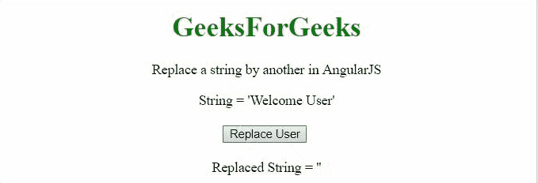
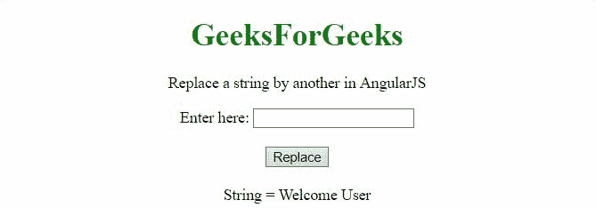

# 如何在 AngularJS 中用另一个字符串替换一个字符串？

> 原文:[https://www . geeksforgeeks . org/如何将一个字符串替换为另一个字符串 in angularjs/](https://www.geeksforgeeks.org/how-to-replace-a-string-by-another-string-in-angularjs/)

在本文中，我们将看到如何在 AngularJS 的帮助下从文本中选择一个字符串并用另一个字符串替换它。

**方法:**方法是用**替换()方法**用新的替换字符串的内容。在第一个例子中，字符串“**欢迎用户**”被单词“**极客**”代替“**用户**”。在第二个示例中，单词“**用户**”被用户在输入元素中输入的字符串替换。

**例 1:**

## 超文本标记语言

```tshtml
<!DOCTYPE HTML>
<html>

<head>
    <script src=
"//ajax.googleapis.com/ajax/libs/angularjs/1.2.13/angular.min.js">
    </script>

    <script>
        var myApp = angular.module("app", []);
        myApp.controller("controller", function ($scope) {
            $scope.str1 = "Welcome User";
            $scope.str2 = "";
            $scope.remSpaces = function () {
                $scope.str2 =
                    $scope.str1.replace("User", "Geek");
            };
        });
    </script>
</head>

<body style="text-align:center;">
    <h1 style="color:green;">
        GeeksForGeeks
    </h1>

<p>
        Replace a string by
        another in AngularJS
    </p>

    <div ng-app="app">
        <div ng-controller="controller">
            String = '{{str1}}'<br><br>
            <button ng-click='remSpaces()'>
                Replace User
            </button>
            <br><br>
            Replaced String = '{{str2}}'<br>
        </div>
    </div>
</body>

</html>    
```

**输出:**



**例 2:**

## 超文本标记语言

```tshtml
<!DOCTYPE HTML>
<html>

<head>
    <script src=
"//ajax.googleapis.com/ajax/libs/angularjs/1.2.13/angular.min.js">
    </script>

<script>
        var myApp = angular.module("app", []);
        myApp.controller("controller", function ($scope) {
            $scope.str1 = "Welcome User";
            $scope.str2 = '';
            $scope.replaceStr = function () {

                // Get & replace the input value
                $scope.str1 = $scope.str1
                    .replace("User", $scope.str2);

            };
        });
    </script>
</head>

<body style="text-align:center;">
    <h1 style="color:green;">
        GeeksForGeeks
    </h1>

<p>
        Replace a string by
        another in AngularJS
    </p>

    <div ng-app="app">
        <div ng-controller="controller">
            Enter here:
            <input type="text"
                name="strExample"
                ng-model="str2">

            <br><br>

            <button ng-click='replaceStr()'>
                Replace</button><br><br>
            String = {{str1}}<br>
        </div>
    </div>
</body>

</html>
```

**输出:**

