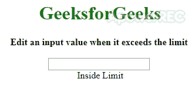

# 如何使用 AngularJS 在超过极限时重置输入值？

> 原文:[https://www . geeksforgeeks . org/如何使用 angularjs/](https://www.geeksforgeeks.org/how-to-reset-an-input-value-when-limit-exceeds-using-angularjs/) 重置超出限制时的输入值

任务是如果用户在输入中输入的数字超过了使用 angularJS 的某个限制，则处理输入字段。我们定义一个 **limitTo** 指令，并在一个 HTML 输入元素上使用它。该指令用于所有溢出限值的处理。该指令在按键事件上调用一个函数，我们可以在其中检查限制。

**示例 1:** 如果用户输入的限制超过 100，本示例将用户输入的值设置为 0。

```tshtml
<!DOCTYPE html>
<html ng-app="myApp">

<head>
    <script src=
"https://ajax.googleapis.com/ajax/libs/angularjs/1.7.9/angular.min.js">
    </script>
</head>

<body ng-controller="MyController">
    <center>
        <h1 style="color: green;">
            GeeksforGeeks
        </h1>
        <b>
            Edit an input value when
            it exceeds the limit
        </b>
        <br><br>

        <!-- Custom directive limit-to -->
        <input limit-to="100"
            type="number"
            ng-model="val"> 
        {{val}}
    </center>

    <script type="text/javascript">
        angular.module('myApp', [])
            .controller('MyController', 
                ['$scope', function($scope) {

                // Value to ng model the input
                $scope.val;
            }])
            .directive("limitTo", ['$timeout', function($timeout) {

                // Declaration of custom directive
                return {
                    restrict: "A",
                    link: function(scope, elem, attrs) {
                        var limit = parseInt(attrs.limitTo);
                        elem.on("keypress", function(e) {
                            $timeout(function() {
                                if (parseInt(e.target.value) > limit)
                                {

                                    // Handle change here
                                    scope.val = 0;
                                    scope.$apply();
                                    e.preventDefault();
                                }
                            });
                        });
                    }
                }
            }]);
    </script>
</body>

</html>
```

**输出:**一旦用户超过 100，该值就被设置回 0。
T3】

**示例 2:** 这里我们根据输入限制更改文本。如果输入值小于 0，则它变为 0。如果它的值大于 100，那么它将变为 100，否则它将保持不变。

```tshtml
<!DOCTYPE html>
<html ng-app="myApp">

<head>
    <script src=
"https://ajax.googleapis.com/ajax/libs/angularjs/1.7.9/angular.min.js">
    </script>
</head>

<body ng-controller="MyController">
    <center>
        <h1 style="color: green;">
          GeeksforGeeks
        </h1>
        <b>
          Edit an input value when it exceeds the limit
        </b>
        <br><br>

        <!-- Custom directive limit-to -->
        <input limit-to="100" type="number" ng-model="val">
        <br> {{text}}
    </center>
    <script type="text/javascript">
        angular.module('myApp', [])
            .controller('MyController', ['$scope', function($scope) {

                // Value to ng model the input
                $scope.val;
                $scope.text = 'Inside Limit';
            }])
            .directive("limitTo", ['$timeout', function($timeout) {

                // Declaration of custom directive
                return {
                    restrict: "A",
                    link: function(scope, elem, attrs) {
                        var limit = parseInt(attrs.limitTo);
                        elem.on("keypress", function(e) {
                            $timeout(function() {
                                if (parseInt(e.target.value) > limit) {

                                    // Handle change here if greater
                                    scope.text = "Outside limit (greater)";
                                    scope.val = 100;
                                    scope.$apply();
                                    e.preventDefault();
                                } else if (parseInt(e.target.value) < 0) {
                                    scope.text = "Outside limit (smaller)";
                                    scope.val = 0
                                    scope.$apply();
                                    e.preventDefault();
                                } else {
                                    scope.text = "Inside Limit";
                                    scope.$apply();
                                    e.preventDefault();
                                }
                            });
                        });
                    }
                }
            }]);
    </script>
</body>

</html>
```

