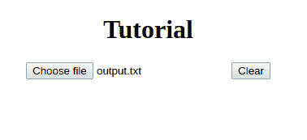
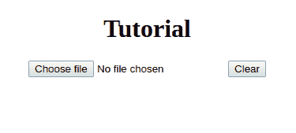

# 如何在 Angular 9 中用输入标签文件类型重置选中文件？

> 原文:[https://www . geesforgeks . org/如何重置带输入标签的选定文件-文件类型-角度-9/](https://www.geeksforgeeks.org/how-to-reset-selected-file-with-input-tag-file-type-in-angular-9/)

要用输入标记文件类型重置所选文件，我们可以实现一个方法，在调用时将清除所选文件。

**进场:**

*   使用“#”设置输入的 id，使其在组件内部可读。
*   现在在组件中，我们可以使用**视图子**指令从 HTML 视图中读取输入的值。
*   为此，请从@angular/core 导入 ViewChild。

```
import { ViewChild } from '@angular/core';
```

*   ViewChild 允许您为输入设置一个引用变量，使用它可以清除输入的值。
*   使用参考变量清除输入值后，所选文件将被重置。

**示例:**

我们将创建一个类似的场景，将有一个输入字段，任务将是创建一个按钮，点击将重置选定的文件。

## java 描述语言

```
import { Component,ViewChild,ElementRef } from '@angular/core';

@Component({
  selector: 'app-root',
  template: `
  <div style="text-align: center;">
  <h1>
    {{title}}
  </h1>
  <input #takeInput type="file" name="filename">

  <!--After clicking this button the file should be reset.-->

  <button (click)="reset()">Clear</button>
  </div>
  `,
  styleUrls: []
})
export class AppComponent {
  title = 'Tutorial'; 

// ViewChild is used to access the input element.

  @ViewChild('takeInput', {static: false})

// this InputVar is a reference to our input.

  InputVar: ElementRef;

  reset() 
  {

// We will clear the value of the input 
// field using the reference variable.

    this.InputVar.nativeElement.value = "";
  }
}
```

**输出:**

选择文件后:



按下清除按钮后:

