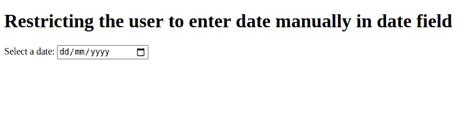

# 如何使用 AngularJS 限制用户在日期字段手动输入日期？

> 原文:[https://www . geesforgeks . org/如何限制用户手动输入日期字段使用-angularjs/](https://www.geeksforgeeks.org/how-to-restrict-user-to-enter-date-manually-in-date-field-using-angularjs/)

在本文中，我们将看到如何限制用户在日期字段中手动输入日期。

**进场:**

*   首先，我们需要编写用于输入的代码，并且我们需要在 HTML 文件中给出它的类型作为日期。
*   然后为了限制用户手动输入日期，我们可以使用 onkeydown 事件。
*   在 onkeydownevent 中，我们需要返回 false，这样我们就可以限制用户手动输入日期。
*   为了实现上述目标，我们需要在 ts 文件中编写和函数并返回 false。
*   由于我们限制用户正常输入日期，用户只能从日历中输入日期。
*   完成上述步骤后，保存并运行项目以查看输出。

**代码实现:**

**app.component.html:**

## 超文本标记语言

```tshtml
<h1>
    Restricting the user to enter 
    date manually in date field
</h1>

<label for="vote">Select a date:</label>

<input type="date" id="vote" name="vote" 
    (keydown)="disableDate()">
```

**app.component.ts:**

## java 描述语言

```tshtml
import { Component } from '@angular/core';

@Component({
  selector: 'my-app',
  templateUrl: './app.component.html',
  styleUrls: [ './app.component.css' ]
})

export class AppComponent  {

  disableDate(){
      return false;
  }  
}
```

**app.module.ts:**

## java 描述语言

```tshtml
import { NgModule } from '@angular/core';
import { BrowserModule } from '@angular/platform-browser';
import { FormsModule } from '@angular/forms';

import { AppComponent } from './app.component';

@NgModule({
  imports:      [ BrowserModule, FormsModule ],
  declarations: [ AppComponent ],
  bootstrap:    [ AppComponent ]
})
export class AppModule { }
```

**输出:**

