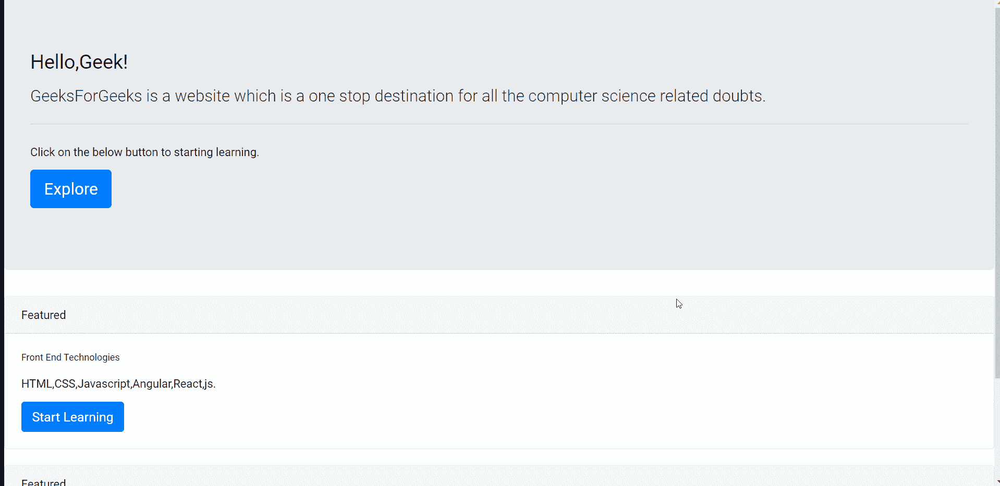

# 如何在 Angular5 中的每次路线点击中滚动到顶部？

> 原文:[https://www . geeksforgeeks . org/如何在每条路线上滚动到顶部-点击角度 5/](https://www.geeksforgeeks.org/how-to-scroll-to-top-on-every-route-click-in-angular5/)

我们可以使用路由器和导航从“@angular/router”开始，因此我们可以滚动到每条路线的网页顶部。

**进场:**

*   首先，我们需要从 app.module.ts 文件和 app.component.ts 中的“@angular/router”导入 Router 和 NavigationEnd。
*   然后我们需要在构造函数中创建它们的一个实例。
*   创建实例后，我们需要在 **ngOninit()** 生命周期钩子中使用它们。
*   在 ngOninit()钩子中，我们需要订阅路由器的事件，并检查它是否是 NavigationEnd 的实例。
*   然后在检查之后，我们可以使用带有(0，0)坐标的 **window.scrollTo()** 函数导航到顶部。

完成上述步骤后，使用下面的命令启动项目。

```ts
ng serve --open
```

以下是上述步骤的实现:

**app.module.ts:**

## java 描述语言

```ts
import { NgModule } from '@angular/core';
import { BrowserModule } from '@angular/platform-browser';
import { RouterModule, Routes } from '@angular/router';

import { AppComponent } from './app.component';

const routes: Routes = [
  { path: '', component: AppComponent },
];

@NgModule({
  imports:      [ BrowserModule, 
        RouterModule.forRoot(routes) ],
  declarations: [ AppComponent ],
  bootstrap:    [ AppComponent ]
})
export class AppModule { }
```

**app.component.ts:**

## java 描述语言

```ts
import { Component, OnInit } from '@angular/core';
import { Router, NavigationEnd } from '@angular/router';

@Component({
    selector: 'app-root',
    templateUrl: './app.component.html'
})
export class AppComponent implements OnInit {
    constructor(private router: Router) { }

    ngOnInit() {
        this.router.events.subscribe((event) => {
            if (!(event instanceof NavigationEnd)) {
                return;
            }
            window.scrollTo(0, 0)
        });
    }
}
```

**app.component.html:**

## 超文本标记语言

```ts
<link href=
"https://maxcdn.bootstrapcdn.com/bootstrap/4.0.0/css/bootstrap.min.css"
    rel="stylesheet">
<div class="jumbotron">
    <h1 class="display-4">Hello,Geek!</h1>
    <p class="lead">
        GeeksForGeeks is a website which 
        is a one stop destination for all 
        the computer science related
        doubts.
    </p>

    <hr class="my-4">

    <p>
        Click on the below button 
        to starting learning.
    </p>

    <p class="lead">
        <a class="btn btn-primary btn-lg" 
            href="#" role="button">
            Explore
        </a>
    </p>
</div>

<div class="card">
    <div class="card-header">
        Featured
    </div>
    <div class="card-body">
        <h5 class="card-title">
            Front End Technologies
        </h5>
        <p class="card-text">
            HTML, CSS, Javascript, 
            Angular, React.js
        </p>

        <a href="#" class="btn btn-primary">
            Start Learning
        </a>
    </div>
</div>
<br>

<div class="card">
    <div class="card-header">
        Featured
    </div>
    <div class="card-body">
        <h5 class="card-title">
            Backend Technologies
        </h5>
        <p class="card-text">
            Node.js, Django,Express
        </p>

        <a href="#" class="btn btn-primary">
            Start Learning
        </a>
    </div>
</div>
```

**输出:**
