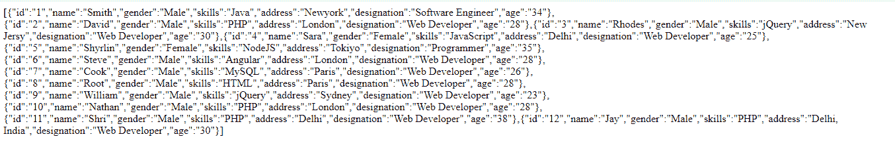
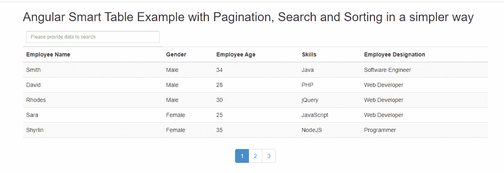
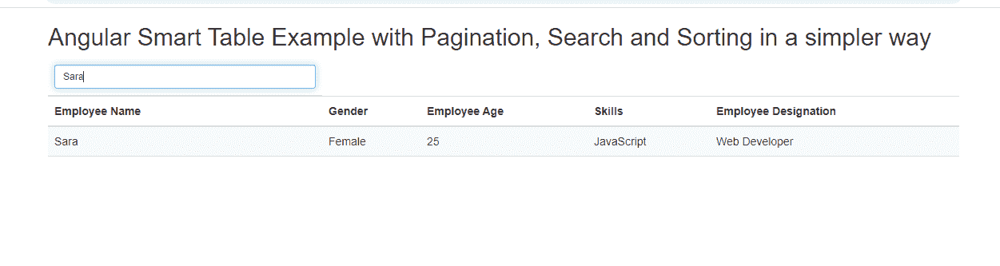

# 如何在角度智能表中搜索特殊字符？

> 原文:[https://www . geeksforgeeks . org/如何搜索角形智能表中的特殊字符/](https://www.geeksforgeeks.org/how-to-search-special-character-in-an-angular-smart-table/)

**智能桌介绍:**

它是一个 Angularjs 模块，用于显示表格格式，具有一组功能，如过滤、排序等。，这对于在 angular js 中以更快的方式准备报告、过滤和搜索数据非常有帮助。它是轻量级的、开发人员友好的、健壮的、模块化的和可扩展的

**接近:**

*   我们可以通过以下方式开始使用智能表
*   凉亭安装角形智能桌(或)
*   npm 安装角度智能工作台
*   一旦执行了上面的脚本，我们就可以使用 angular-smart-table 了

**语法:**

1.  将模块*angular . module(<名为>)[“智能表”]* 添加到 angular 应用程序中。
2.  就像遵循普通的 html 表结构一样，在 table 元素上，需要添加“ **st-table** ”属性来通知 smart-table 将显示数据的集合(即使用 repeater)
3.  要在角度智能表中搜索内容，我们需要使用 **stSearch 指令。**可以是需要搜索的搜索项的逗号分隔列表
4.  **可以使用 stDebounceTime 属性**(值以毫秒为单位)来控制搜索时间。有时会进行无用的调用(尤其是连接到服务器时)，为了克服这一点，需要这个属性。
5.  在搜索过程中，输入可以是正则表达式模式。有时，为了转义输入中的 regexp 特定字符，我们需要使用**stsearcheescape 属性。**

**基本示例和说明:**

让我们看看在智能表中搜索以及过滤和分页的示例代码，如下面的代码所示

数据是从我们示例的“http://coderszine . com/demo/rest-API/v1/employee/read”中检索的

**stSafeSrc 属性:**

由于我们已经从 restful 端点(甚至从远程数据库、restful 端点、ajax 调用等)获取了数据
我们需要使用这个属性。此外，智能表创建显示集合的副本，并且由于涉及异步数据，因此该属性是必须的。

这里的“雇员”是异步检索的，需要被呈现，并在 st-safe-src 中指定

排序应用于所有列，因此 st-sort 用于排序。

分页应用于每页 5 条记录。

**输入:**


使用上述方法，让我们用搜索、排序和分页功能在智能表中呈现数据

```ts
SampleApp = angular.module(
'SampleApp', ['SampleApp.controllers', 'smart-table']);    

angular.module('SampleApp.controllers', []).controller(
'sampleController',
['$scope', '$http', function($scope, $http) 
{
    $scope.loading = false;
    $scope.getData = function() {
        $scope.loading = true;
        $http.get(
"http://coderszine.com/demo/rest-api/v1/employee/read")
        .then(function(response){
            $scope.employees = response.data;
            $scope.loading = false;
        });
    }
    $scope.getData();
}]);
```

**HTML:**

```ts
<!DOCTYPE html>
<html>
    <head>
        <meta http-equiv="Content-Type" 
              content="text/html; charset=utf-8" />
        <link rel="stylesheet"
              href=
"https://maxcdn.bootstrapcdn.com/bootstrap/3.0.2/css/bootstrap.min.css" />
        <script src=
"https://ajax.googleapis.com/ajax/libs/angularjs/1.5.0/angular.js">
      </script>
        <script src=
"https://cdnjs.cloudflare.com/ajax/libs/angular-smart-table/2.1.8/smart-table.min.js">
      </script>
        <link rel="stylesheet" 
              href=
"https://fonts.googleapis.com/css?family=Open+Sans" />
        <!-- Indication to know we are
              using smartTableApp.js -->
        <script src="smartTableApp.js">
      </script>
    </head>
    <body>
        <!-- Including our SampleApp and 
             iterate in Angular JS  -->
        <div class="container" 
             ng-app="SampleApp"
             ng-controller="sampleController">
            <h2>Angular Smart Table Example with
              Pagination, Search and Sorting in 
              a simpler way</h2>
            <div ng-show="loading"><h3>Loading the data...</h3>
          </div>
            <table st-table="displayEmployee" 
                   st-safe-src="employees"
                   class="table table-striped">
                <thead>
                    <tr>
                        <th colspan="1">
                            <input st-search placeholder=
                                   "Please provide data to search" 
                                   class="input-sm form-control" 
                                   type="search" />
                        </th>
                    </tr>
                    <tr>
                        <th st-sort="name">Employee Name</th>
                        <th st-sort="gender">Gender</th>
                        <th st-sort="age">Employee Age</th>
                        <th st-sort="skills">Skills</th>
                        <th st-sort="designation">
                          Employee Designation</th>
                    </tr>
                </thead>
                <tbody>
                    <tr st-select-row="row"
                        st-select-mode="multiple" 
                        ng-repeat="employee in displayEmployee">
                        <td>{{employee.name}}</td>
                        <td>{{employee.gender}}</td>
                        <td>{{employee.age}}</td>
                        <td>{{employee.skills}}</td>
                        <td>{{employee.designation}}</td>
                    </tr>
                </tbody>
                <tfoot>
                    <tr>
                        <td colspan="5" class="text-center">
                            <div st-pagination="" 
                                 st-items-by-page="5"></div>
                        </td>
                    </tr>
                </tfoot>
            </table>
        </div>
    </body>
</html>
```

**输出:**


**搜索文本后**


**根据名称**
排序