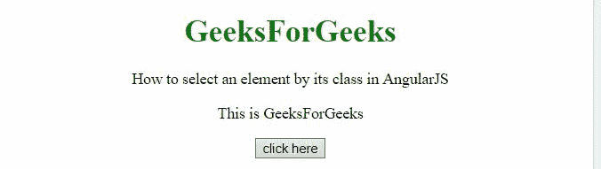
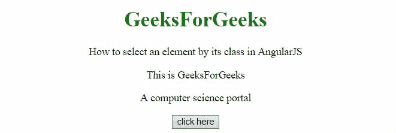

# 如何在 AngularJS 中通过元素的类名来选择元素？

> 原文:[https://www . geeksforgeeks . org/如何按类名称选择元素 in angularjs/](https://www.geeksforgeeks.org/how-to-select-an-element-by-its-class-name-in-angularjs/)

给定一个 HTML 文档，任务是使用 AngularJS 按类名选择一个元素。

**方法:**方法是使用 **document.querySelector()方法**获取特定类名的元素。在第一个示例中，选择了类别名称**类别 1** 的元素，并且将其背景颜色更改为绿色。在第二个示例中，选择了同一个类的 2 个元素，并且更改了一些 CSS。

**例 1:**

```html
<!DOCTYPE HTML>
<html>

<head>
    <script src=
"//ajax.googleapis.com/ajax/libs/angularjs/1.2.13/angular.min.js">
    </script>

    <script>
        var myApp = angular.module("app", []);
        myApp.controller("controller", function ($scope) {
            $scope.getClass = function () {
                var el = angular.element(
                    document.querySelector(".class1"));
                el.css('background', 'green');
            };
        });
    </script>
</head>

<body style="text-align:center;">
    <h1 style="color:green;">
        GeeksForGeeks
    </h1>
    <p>
        How to select an element by
        its class in AngularJS
    </p>
    <div ng-app="app">
        <div ng-controller="controller">
            <p class="class1">
                This is GeeksForGeeks
            </p>
            <input type="button" 
                value="click here" 
                ng-click="getClass()">
        </div>
    </div>
</body>

</html>     
```

**输出:**



**例 2:**

```html
<!DOCTYPE HTML>
<html>

<head>
    <script src=
"//ajax.googleapis.com/ajax/libs/angularjs/1.2.13/angular.min.js">
    </script>

    <script>
        var myApp = angular.module("app", []);
        myApp.controller("controller", function ($scope) {
            $scope.getClass = function () {
                var el = angular.element(
                    document.querySelectorAll(".class1"));

                el.css({ 
                    'background': 'green', 
                    'color': 'white' 
                });
            };
        });
    </script>
</head>

<body style="text-align:center;">
    <h1 style="color:green;">
        GeeksForGeeks
    </h1>
    <p>
        How to select an element by 
        its class in AngularJS
    </p>
    <div ng-app="app">
        <div ng-controller="controller">
            <p class="class1">
                This is GeeksForGeeks
            </p>
            <p class="class1">
                A computer science portal
            </p>
            <input type="button" 
                value="click here" 
                ng-click="getClass()">
        </div>
    </div>
</body>

</html>    
```

**输出:**

