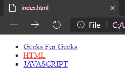
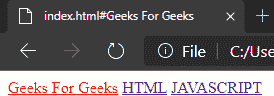

# 如何用 AngularJS 设置活动标签样式？

> 原文:[https://www . geesforgeks . org/how-set-active-tab-style-with-angularjs/](https://www.geeksforgeeks.org/how-to-set-active-tab-style-with-angularjs/)

要使用[](https://www.geeksforgeeks.org/angularjs-tutorials/)**设置活动标签样式，我们需要使用**活动**和 [**ng-controller**](https://www.geeksforgeeks.org/angularjs-ng-controller-directive/) 方法。**

****方法 1:****

****AngularJS** 中的 **ng-controller** 指令用于向应用程序添加控制器。它可以用来添加方法、函数和变量，这些方法、函数和变量可以在点击等事件上被调用来执行某些操作。**

****语法:****

```ts
<element ng-controller="expression"> Contents... </element>
```

**以下示例实现了上述方法:**

**让我们通过一个简单的代码来看看这个。这是最简单的方法之一。**

****例 1:****

```ts
<!DOCTYPE html>
<html>
    <head> </head>
    <body>
        <div class="collapse navbar-collapse" 
             ng-controller="HeaderController">
            <ul class="nav navbar-nav">
                <li ng-class="{ active: isActive('/')}">
                  <a href="/">Geeks For Geeks</a></li>
                <li ng-class="{ active: isActive('/html')}">
                  <a href="/html">HTML</a></li>
                <li ng-class="{ active: isActive('/js')}">
                  <a href="/js">JAVASCRIPT</a></li>
            </ul>
        </div>
        <div ng-view></div>
        <script>
            function HeaderController($scope, $location) {
                $scope.isActive = function (viewLocation) {
                    return viewLocation === $location.path();
                };
            }
        </script>
    </body>
</html>
```

****输出:****

**[](https://media.geeksforgeeks.org/wp-content/uploads/20200805230008/Screenshot17.png)**

****方法二:****

**这里我们将使用 Angular JS 中的[**模块化功能**](https://www.geeksforgeeks.org/angularjs-modules/) 来创建一个模块。使用 **AngularJS** 功能 **angular.module 创建一个模块。****

****创建模块的语法:****

```ts
<div ng-app="myFirstApp">...</div>
<script>
var app = angular.module("myFirstApp", []);

//myFirstApp refers to HTML element in which application runs.
</script>
```

**向模块添加**指令**的语法:**

```ts
<div ng-app="myApp"></div>
<script>
var my_app = angular.module("myFirstApp", []);
my_app.directive("DirectiveApp", function() {
  return {
    template : "Hello Geeks!!!"
  };
});
</script>
```

****例 2:****

```ts
<!DOCTYPE html>
<html>
<head>
</head>
<body>
    <div ng-app="link">
        <a href="#Geeks For Geeks"
           active-link="active">Geeks For Geeks</a>
        <a href="#HTML" 
           active-link="active">HTML</a>
         <a href="#JAVASCRIPT" 
            active-link="active">JAVASCRIPT</a>
    </div> 
    <script>
        angular.module('link', []).directive(
          'Link', ['$location', function(location) {
           return {
                   link: function(scope, element, attrs) {
                       var active = attrs.activeLink;
                       var path = attrs.href;
                    path = path.substring(1); 
                    scope.location = location;
                    scope.$watch(
                      'location.path()', function(newPath) {
                        if (path === newPath) {
                               element.addClass(active);
                        } 
                        else {
                               element.removeClass(active);
                           }
                       });
                   }
               };
          }]);
    </script>
</body>
</html>
```

****输出:****

**[](https://media.geeksforgeeks.org/wp-content/uploads/20200805225600/Screenshot13.png)**