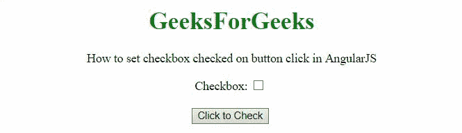

# 如何在 AngularJS 中设置按钮点击复选框？

> 原文:[https://www . geeksforgeeks . org/如何设置复选框-选中-点击按钮-点击-angularjs/](https://www.geeksforgeeks.org/how-to-set-checkbox-checked-on-button-click-in-angularjs/)

在本文中，我们将看到如何在 AngularJS 中设置点击按钮时选中的复选框。

**方法:**方法是使用**勾选**来勾选 DOM 中的复选框。在第一个示例中，按钮选中单个复选框，在第二个示例中，按钮选中多个复选框。 **ng-model** 用于绑定复选框。

**例 1:**

```tshtml
<!DOCTYPE HTML>
<html>

<head>
    <script src=
"//ajax.googleapis.com/ajax/libs/angularjs/1.2.13/angular.min.js">
    </script>

    <script>
        var myApp = angular.module("app", []);
        myApp.controller("controller", function ($scope) {
            $scope.checkIt = function () {
                if (!$scope.check) {
                    $scope.check = true;
                } else {
                    $scope.check = false;
                }
            }
        });
    </script>
</head>

<body style="text-align:center;">
    <h1 style="color:green;">
        GeeksForGeeks
    </h1>
    <p>
        How to set checkbox checked on
        button click in AngularJS
    </p>
    <div ng-app="app">
        <div ng-controller="controller">
            Checkbox: <input type="checkbox" 
                ng-checked="check">
            <br>
            <br>
            <button ng-click="checkIt()" 
                ng-model='check'>
                Click to Check 
            </button>
            <br>
            <br>
        </div>
    </div>
</body>

</html>
```

**输出:**



**例 2:**

```tshtml
<!DOCTYPE HTML>
<html>

<head>
    <script src=
"//ajax.googleapis.com/ajax/libs/angularjs/1.2.13/angular.min.js">
    </script>

    <script>
        var myApp = angular.module("app", []);
        myApp.controller("controller", function ($scope) {
            $scope.checkIt = function () {
                if (!$scope.check) {
                    $scope.check = true;
                } else {
                    $scope.check = false;
                }
            }
        });
    </script>
</head>

<body style="text-align:center;">
    <h1 style="color:green;">
        GeeksForGeeks
    </h1>
    <p>
        How to set checkbox checked on
        button click in AngularJS
    </p>
    <div ng-app="app">
        <div ng-controller="controller">
            Checkbox1: <input type="checkbox" 
                    ng-checked="check">
            <br>
            Checkbox2: <input type="checkbox" 
                    ng-checked="check">
            <br>
            Checkbox3: <input type="checkbox" 
                    ng-checked="check">
            <br>
            <br>
            <button ng-click="checkIt()" 
                    ng-model='check'>
                Click to Check 
            </button>
            <br>
            <br>
        </div>
    </div>
</body>

</html>
```

**输出:**

