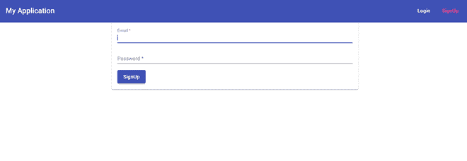

# 如何在 AngularJS 中页面加载时自动设置输入字段的焦点？

> 原文:[https://www . geesforgeks . org/如何设置焦点-输入-字段-页面自动加载-in-angularjs/](https://www.geeksforgeeks.org/how-to-set-focus-on-input-field-automatically-on-page-load-in-angularjs/)

我们可以使用角度指令自动聚焦于任何输入域。在这里，我们创建了一个自定义指令，可以自动关注表单中的任何字段。

创建自定义指令就像创建角度组件一样。要创建自定义指令，我们必须用**@指令**装饰器替换**@组件**装饰器。

**进场:**

*   创建要使用的角度应用程序。
*   创建指令**【自动对焦】** ，处理输入字段的自动对焦。在这个指令中，将 HTML 元素设置为焦点。
*   然后在 *app.module.ts* 中导入该指令，并将其添加到提供商列表中。
*   创建一个简单的表单，在这个表单上，我们将输入字段设置为关注页面重载。因此，我们创建了一个注册表单，其中有两个输入字段**“电子邮件”**和**“密码”**，并将指令**“自动对焦”**添加到**“电子邮件”**输入字段中，然后该字段在页面重新加载时自动对焦。

**语法:**在**下方【自动对焦】**输入栏内是自动对焦该输入栏的指令。

```
<input autofocus type="email" name="email" #email="ngModel" ngModel />
```

因此，让我们创建一个简单的自定义指令“自动对焦”，处理输入字段自动对焦。

#### 示例:

## auto-focus.directive.ts

```
import {AfterViewInit, Directive,ElementRef} from '@angular/core'

@Directive({
    selector:'autofocus'
})
export class AutoFocus implements AfterViewInit{

    constructor(
        private elementRef: ElementRef
    ){}

    ngAfterViewInit(){
        this.elementRef.nativeElement.focus();
    }
}
```

在上面的代码中，我们创建了一个指令“自动对焦”，这里“自动对焦”是这个指令的名称/选择器，每当我们想要使用这个指令时，我们都必须提供选择器。我们正在使用有角度的*“ngafterviewit”*生命周期钩子，使元素在视图初始化后聚焦。

现在我们必须确保 angular 知道我们新创建的指令，所以我们必须在*“app . module . ts”*文件中提供它。

## app.module.ts

```
import { NgModule } from '@angular/core';

import { AppComponent } from './app.component';
import { AutoFocus } from './auth/signup/autofocus.directive';

@NgModule({
  declarations: [
    AppComponent,
    AutoFocus
  ],
  imports: [],
  providers: [],
  bootstrap: [AppComponent],
})

export class AppModule { }
```

因此，这里我们在“声明”数组中提供了“AutoFocus”指令，并确保将其导入。

现在，我们必须创建一个输入字段，我们将在其上应用此自动对焦指令。为此，我们创建了一个简单的注册表单，在这个表单用户中，电子邮件输入字段自动关注页面重载。

## signup.component.html

```
<form (submit)="onSignup(form)" #form="ngForm" >
  <mat-card>
    <mat-form-field>
      <!-- 
        AutoFocus directive applied in the below
        input field
       -->
      <input
      autofocus 
      type="email"
       matInput 
       name="email"
       #email="ngModel"
       ngModel
       />
    </mat-form-field>
    <mat-form-field>
        <input ngModel #password="ngModel" type="password" 
        matInput placeholder="Password" name="password">
    </mat-form-field>
    <button
      type="submit"
      mat-raised-button color="primary">
      <span>SignUp</span>
    </button>
  </mat-card>
</form>
```

```
<input autofocus type="email" matInput 
    name="email" #email="ngModel" ngModel />
```

因此，在上面的表单中，电子邮件输入字段中提供了“自动对焦”指令，该字段在页面重新加载时自动对焦。

**输出:**

