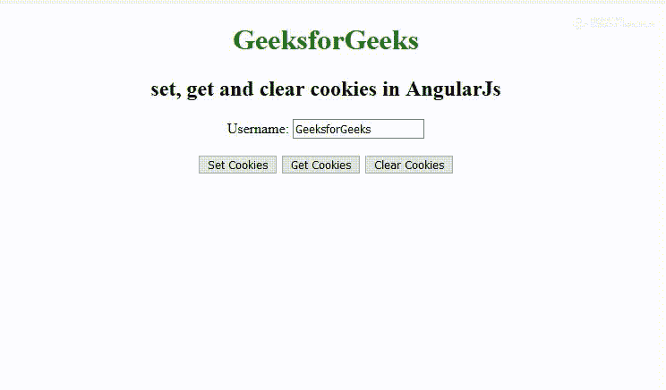

# 如何在 AngularJs 中设置、获取和清除 cookies？

> 原文:[https://www . geeksforgeeks . org/如何设置获取和清除 in-angularjs-cookies/](https://www.geeksforgeeks.org/how-to-set-get-and-clear-cookies-in-angularjs/)

在 AngularJs 中，我们需要使用 **angular-cookies.js** 来**设置**、**获取**、**清除**cookies。

您可以为此使用实时 cdn 链接:
[https://cdnjs . cloudflare . com/Ajax/libs/angular . js/1 . 6 . 1/angular-cookies . js](https://cdnjs.cloudflare.com/ajax/libs/angular.js/1.6.1/angular-cookies.js)

我们需要在你的控制器中包含 **$cookies** ，并且它必须有获取、设置和清除方法来分别获取、设置和清除 cookies。

Angular 内置了名为 **ngCookies** 的指令。

*   **写 Cookie:**
    当点击写 Cookie 按钮时，控制器的写 Cookie 功能被调用。WriteCookie 函数使用 ngCookies 模块的$CookieStore 服务将输入框值保存为 cookie。

**$ cookieStore put 函数有两个参数:**

*   名称(密钥)
*   价值

**语法:**

```
$scope.SetCookies = function () {
    $cookies.put("username", $scope.username);
};

```

*   **Reading Cookies:**

    当点击读取 Cookie 按钮时，控制器的读取 Cookie 函数被调用。ReadCookie 函数使用 ngCookies 模块的$cookieStore 服务获取 Cookie 的值。

    **$ cookieStore get 函数有一个参数:**

    *   名称(密钥)

    **语法:**

    ```
    $scope.GetCookies = function () {
        $window.alert($cookies.get('username'));
    };

    ```

    *   **Removing Cookies:**

    当点击删除 Cookie 按钮时，控制器的删除 Cookie 函数被调用。函数的作用是:使用 ngCookies 模块的$cookieStore 服务删除 Cookie。

    **$ cookieStore 移除函数有一个参数:**

    *   名称(密钥)

    **语法:**

    ```
    $scope.ClearCookies = function () {
        $cookies.remove('username');
    };

    ```

    **示例:**

    ```
    <!DOCTYPE html>
    <html>

    <head>
        <title>
            A Simple example of Get,
          Set and Clear Cookie in AngularJS
        </title>
    </head>

    <body>
        <center>
            <h1 style="color:green">GeeksforGeeks</h1>
            <h2>set, get and clear cookies in AngularJs</h2>
            <script type="text/javascript" 
                    src=
    "https://cdnjs.cloudflare.com/ajax/libs/angular.js/1.6.1/angular.min.js">
            </script>
            <script type="text/javascript" 
                    src=
    "https://cdnjs.cloudflare.com/ajax/libs/angular.js/1.6.1/angular-cookies.js">
            </script>
            <script type="text/javascript">
                var app =
                    angular.module('MyApp', ['ngCookies']);

                app.controller('CookiesController', function(
                    $scope, $window, $cookies) {
                    $scope.SetCookies = function() {
                        $cookies.put("username", $scope.username);
                    };

                    $scope.GetCookies = function() {
                        $window.alert($cookies.get('username'));
                    };

                    $scope.ClearCookies = function() {
                        $cookies.remove('username');
                    };

                });
            </script>
            <div ng-app="MyApp" ng-controller="CookiesController">
                Username:
                <input type="text" 
                       ng-model="username" />
                <br />
                <br />
                <input type="button"
                       value="Set Cookies"
                       ng-click="SetCookies()" />

                <input type="button" 
                       value="Get Cookies" 
                       ng-click="GetCookies()" />

                <input type="button" 
                       value="Clear Cookies"
                       ng-click="ClearCookies()" />
            </div>
        </center>
    </body>

    </html>
    ```

    **输出:**
    