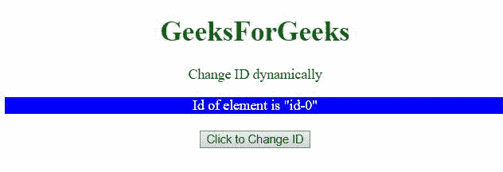

# 如何使用 AngularJS 动态设置元素的 id 属性？

> 原文:[https://www . geesforgeks . org/how-set-id-attribute-of-element-dynamic-use-angularjs/](https://www.geeksforgeeks.org/how-to-set-id-attribute-of-an-element-dynamically-using-angularjs/)

在本文中，我们将讨论如何使用 AngularJS 动态更改任何元素的 ID。

**方法 1:**

*   在这种方法中，单击按钮时会调用一个函数，该函数会将元素的 ID 更改为 **id-5** 。
*   我们正在范围变量上调用一个函数，并将 ID 从 **id-1** 更改为 **id-5** 。

**例 1:**

## 超文本标记语言

```ts
<!DOCTYPE HTML> 
<html>  

<head>
    <script src=
"https://ajax.googleapis.com/ajax/libs/angularjs/1.2.13/angular.min.js">
    </script>

    <script>
        var myApp = angular.module("app", []);
            myApp.controller("controller", 
            function($scope) {
            $scope.id = 1;
            $scope.IdChange = function() {
                $scope.id = 5;
            };
        });
    </script> 

    <style>
        #id-1{ 
            color: red;
        }
        #id-5{
            color: green;
        }
    </style>
</head>   

<body style="text-align:center;">
    <h1 style="color:green;">  
        GeeksForGeeks  
    </h1> 

    <p>
        Change ID dynamically
    </p>

    <div ng-app="app">  
        <div ng-controller="controller">  
            <div id="id-{{id}}">
                Id of element is "id-{{id}}" 
            </div>
            <br>
            <button ng-click="IdChange()">
                Click to Change ID
            </button>  
        </div>  
    </div> 
</body>   

</html>
```

**输出:**


**方法 2:** 在这种方法中，点击按钮时会调用一个函数，将 ID 从一个变为另一个。我们正在范围变量上调用一个函数，并将 ID 从 **id-0** 更改为 **id-1，id-1** 更改为 **id-2** 、**T9】和 **id-2** 更改为 **id-0。****

**例 2:**

## 超文本标记语言

```ts
<!DOCTYPE HTML> 
<html>  

<head>
    <script src=
"https://ajax.googleapis.com/ajax/libs/angularjs/1.2.13/angular.min.js">
    </script>

    <script>
        var myApp = angular.module("app", []);
            myApp.controller("controller", function($scope) {
            $scope.id = 1;
            $scope.IdChange = function() {
                 $scope.id = ($scope.id + 1)%3;
            };
        });
    </script> 
    <style>
        #id-0 { 
          color: white;
          background: blue;
        }
        #id-1 {
          color: white;
          background: green;
        }
        #id-2 {
          color: white;
          background: red;
        }
    </style>
</head>   

<body style="text-align:center;">
    <h1 style="color:green;">  
        GeeksForGeeks  
    </h1> 

<p>
    Change ID dynamically
    </p>

    <div ng-app="app">  
        <div ng-controller="controller">  
            <div id="id-{{id}}">
                Id of element is "id-{{id}}" 
            </div>
            <br>
            <button ng-click="IdChange()">
                Click to Change ID
            </button>  
        </div>  
    </div> 
</body>   

</html>
```

**输出:**



**方法 3:** 在该方法中，元素的 ID 由 **<输入>元素来设置。**

**示例:**

## 超文本标记语言

```ts
<!DOCTYPE HTML> 
<html>  

<head>
    <script src=
"https://ajax.googleapis.com/ajax/libs/angularjs/1.2.13/angular.min.js">
    </script>

    <script>
        var myApp = angular.module("app", []);
            myApp.controller("controller", function($scope) {
            $scope.id = 1;
            $scope.IdChange = function() {
                 $scope.id = $scope.textval;
            };
        });
    </script> 
    <style>
        #id-0 { 
          color: white;
          background: blue;
        }
        #id-1 {
          color: white;
          background: green;
        }
        #id-2 {
          color: white;
          background: red;
        }
    </style>
</head>   

<body style="text-align:center;">
    <h1 style="color:green;">  
        GeeksForGeeks  
    </h1> 

<p>
    Change ID dynamically
    </p>

    <div ng-app="app">  
        <div ng-controller="controller">  
            <div id="id-{{id}}">
                Id of element is "id-{{id}}" 
            </div>
            <br>
            Enter ID: <input type="text" ng-model="textval" >
            <br>
            <br>
            <button ng-click="IdChange()">
                Click to Change ID
            </button>  
        </div>  
    </div> 
</body>   

</html>
```

**输出:**

