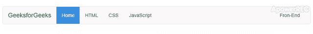

# 如何用 Bootstrap 和 AngularJS 设置 navbar 活动类？

> 原文:[https://www . geesforgeks . org/how-set-nav bar-active-class-with-bootstrap-and-angularjs/](https://www.geeksforgeeks.org/how-to-set-navbar-active-class-with-bootstrap-and-angularjs/)

要在引导导航栏中设置活动类，可以使用 [**ng-controller(导航控制器)**](https://www.geeksforgeeks.org/angularjs-ng-controller-directive/) 用 AngularJS 设置引导导航栏活动类。在**外运行单个控制器-查看**。单击角度路线时，您可以将 class= "active "设置为活动。
下面的例子实现了上面的方法:
**例子:**这个例子解释了如何使用 ng-controller 用 AngularJS 设置 bootstrap navbar 活动类。

## 超文本标记语言

```
<!DOCTYPE html>
<html lang="en" >

<head>
    <meta charset="UTF-8">

    <title>
        Bootstrap Navbar Change
        Active Class Link
    </title>

    <link rel="stylesheet" href=
"https://cdnjs.cloudflare.com/ajax/libs/normalize/5.0.0/normalize.min.css">

    <link rel='stylesheet' href=
'https://cdnjs.cloudflare.com/ajax/libs/twitter-bootstrap/3.3.7/css/bootstrap.min.css'>

    <script src=
'https://cdnjs.cloudflare.com/ajax/libs/twitter-bootstrap/3.3.7/js/bootstrap.min.js'>
    </script>

    <script src=
'https://cdnjs.cloudflare.com/ajax/libs/jquery/3.1.0/jquery.min.js'>
    </script>

    <style>
        body {
            margin: 20px;
        }
        #topheader .navbar-nav li > a {
            text-transform: capitalize;
            color: #333;
            -webkit-transition: background-color .2s, color .2s;
            transition: background-color .2s, color .2s;
        }
        #topheader .navbar-nav li > a:hover,
        #topheader .navbar-nav li > a:focus {
            background-color: #005596;
            color: #fff;
        }
        #topheader .navbar-nav li.active > a {
            background-color: #3990E0;
            color: white;
        }
    </style>
</head>

<body>
    <div id="topheader">
        <nav class="navbar navbar-default">
            <div class="container-fluid">
                <div class="navbar-header">
                    <a class="navbar-brand" href="#"
                    style="color: green;">GeeksforGeeks</a>
                </div>

                <div class="collapse navbar-collapse"
                        id="bs-example-navbar-collapse-1">
                    <ul class="nav navbar-nav">
                        <li class="active"><a href="#home">
                            home</a>
                        </li>
                        <li><a href="#page1">HTML</a></li>
                        <li><a href="#page2">CSS</a></li>
                        <li><a href="#page3">JavaScript</a></li>
                    </ul>
                    <ul class="nav navbar-nav navbar-right">
                        <li><a href="#">Front-End</a></li>
                    </ul>
                </div>
            </div>
        </nav>
    </div>

    <script>
        $( '#topheader .navbar-nav a' ).on('click',
                    function () {
            $( '#topheader .navbar-nav' ).find( 'li.active' )
            .removeClass( 'active' );
            $( this ).parent( 'li' ).addClass( 'active' );
        });
    </script>
</body>

</html>
```

**输出:**

