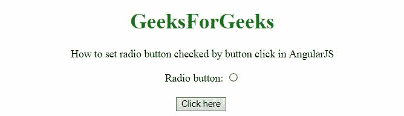
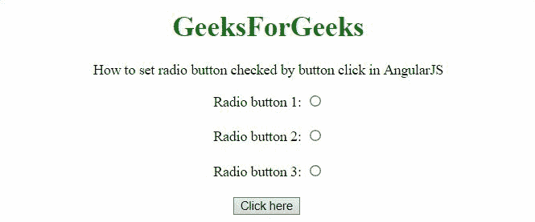

# 如何在 AngularJS 中设置按钮点击勾选的单选按钮？

> 原文:[https://www . geesforgeks . org/如何设置单选按钮-按按钮检查-点击进入 angularjs/](https://www.geeksforgeeks.org/how-to-set-radio-button-checked-by-button-click-in-angularjs/)

在本文中，我们将看到如何在 AngularJS 中通过按钮点击来设置单选按钮。

**方法:**方法是使用 **ng-checked** 检查 DOM 中的单选按钮。在第一个示例中，单个单选按钮被按钮选中，在第二个示例中，多个单选按钮被按钮选中。 **ng-mode** l 用于绑定单选按钮。

**例 1:**

```html
<!DOCTYPE HTML>
<html>

<head>
    <script src=
"//ajax.googleapis.com/ajax/libs/angularjs/1.2.13/angular.min.js">
    </script>

    <script>
        var myApp = angular.module("app", []);
        myApp.controller("controller", function ($scope) {
            $scope.radioCh = function () {
                if (!$scope.radio) {
                    $scope.radio = true;
                } else {
                    $scope.radio = false;
                }
            }
        });
    </script>
</head>

<body style="text-align:center;">
    <h1 style="color:green;">
        GeeksForGeeks
    </h1>
    <p>
        How to set radio button checked
        by button click in AngularJS
    </p>

    <div ng-app="app">
        <div ng-controller="controller">
            Radio button: <input type="radio" 
                    ng-checked="radio">
            <br><br>
            <button ng-click="radioCh()" 
                    ng-model='radio'>
                Click here
            </button>
            <br><br>
        </div>
    </div>
</body>

</html>
```

**输出:**



**例 2:**

```html
<!DOCTYPE HTML>
<html>

<head>
    <script src=
"//ajax.googleapis.com/ajax/libs/angularjs/1.2.13/angular.min.js">
    </script>

    <script>
        var myApp = angular.module("app", []);
        myApp.controller("controller", function ($scope) {
            $scope.radioCh = function () {
                if (!$scope.radio) {
                    $scope.radio = true;
                } else {
                    $scope.radio = false;
                }
            }
        });
    </script>
</head>

<body style="text-align:center;">
    <h1 style="color:green;">
        GeeksForGeeks
    </h1>
    <p>
        How to set radio button checked
        by button click in AngularJS
    </p>
    <div ng-app="app">
        <div ng-controller="controller">
            Radio button 1: <input type="radio" 
                ng-checked="radio">
            <br><br>

            Radio button 2: <input type="radio" 
                    ng-checked="radio">
            <br><br>

            Radio button 3: <input type="radio" 
                    ng-checked="radio">
            <br><br>

            <button ng-click="radioCh()" 
                    ng-model='radio'>
                Click here
            </button>
            <br><br>
        </div>
    </div>
</body>

</html>       
```

**输出:**

