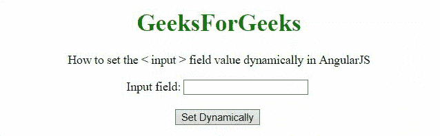

# 如何在 AngularJS 中动态设置输入字段值？

> 原文:[https://www . geeksforgeeks . org/如何在 angularjs 中动态设置输入字段值/](https://www.geeksforgeeks.org/how-to-set-the-input-field-value-dynamically-in-angularjs/)

给定一个输入字段，任务是在 AngularJS 的帮助下动态设置输入字段值。

**进场:**

*   不管用户是否输入内容，都将在输入字段中设置一个值。
*   **ng-click** 事件用于调用一个函数，该函数在 **ng-model 的帮助下将值设置为“这是极客 ForGeeks”。**

**例 1:** 在本例中，输入字段为**只读**，用户不能修改，数值是动态设置的。

## 超文本标记语言

```html
<!DOCTYPE HTML>
<html>

<head>
    <script src=
"https://ajax.googleapis.com/ajax/libs/angularjs/1.2.13/angular.min.js">
    </script>

    <script>
        var myApp = angular.module("app", []);
        myApp.controller("controller", function ($scope) {
            $scope.nameText = '';
            $scope.setVal = function () {
                $scope.nameText = "This is GeeksForGeeks";
            };
        });
    </script>
</head>

<body style="text-align:center;">
    <h1 style="color:green;">
        GeeksForGeeks
    </h1>

    <p>
        How to set the <input> field 
        value dynamically in AngularJS
    </p>

    <div ng-app="app">
        <div ng-controller="controller">
            Input field: <input type="text" 
                readonly name="mytext" 
                ng-model="nameText">
            <br><br>
            <input type="button" 
                ng-click="setVal()" 
                value="Set Dynamically">
            <br>
        </div>
    </div>
</body>

</html>
```

**输出:**


**例 2:** 在本例中，用户可以修改输入字段，但用户输入的值可以动态设置。

## 超文本标记语言

```html
<!DOCTYPE HTML>
<html>

<head>
    <script src=
"https://ajax.googleapis.com/ajax/libs/angularjs/1.2.13/angular.min.js">
    </script>

    <script>
        var myApp = angular.module("app", []);
        myApp.controller("controller", function ($scope) {
            $scope.nameText = '';
            $scope.setVal = function () {
                $scope.nameText = "This is GeeksForGeeks";
            };
        });
    </script>
</head>

<body style="text-align:center;">
    <h1 style="color:green;">
        GeeksForGeeks
    </h1>

    <p>
        How to set the <input> field 
        value dynamically in AngularJS
    </p>

    <div ng-app="app">
        <div ng-controller="controller">
            Input field: <input type="text" 
                name="mytext" ng-model="nameText">
            <br>
            <br>
            <input type="button" 
                ng-click="setVal()" 
                value="Set Dynamically">
            <br>
        </div>
    </div>
</body>

</html>
```

**输出:**

